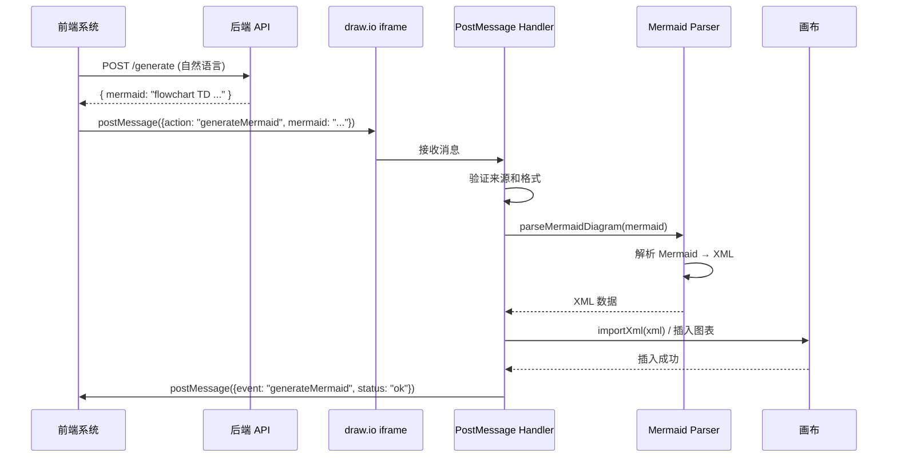
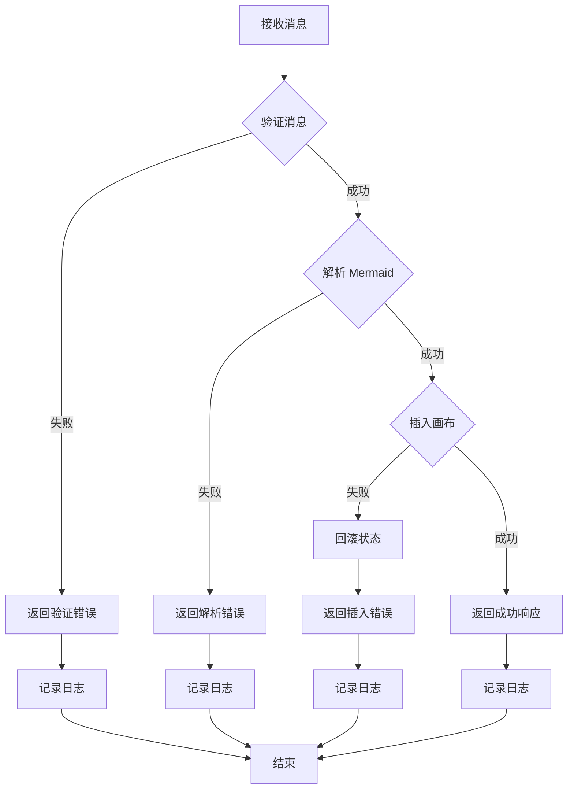

# 设计文档：Mermaid iframe 集成

## 概述

本设计文档描述了如何在 draw.io 中实现通过 iframe postMessage 接收 Mermaid 文本并自动生成图表的功能。该功能允许外部前端系统通过标准的浏览器 postMessage API 与嵌入的 draw.io iframe 通信，发送 Mermaid 语法文本，draw.io 将自动解析并将生成的图表插入到画布中。

### 设计目标

1. **简单集成**：前端系统只需发送 Mermaid 文本，无需了解 draw.io 内部实现
2. **安全可靠**：验证消息来源，防止 XSS 和 DoS 攻击
3. **向后兼容**：不影响现有的 postMessage 处理逻辑
4. **错误友好**：提供详细的错误信息和日志，便于调试

### 技术栈

- **JavaScript**：draw.io 的主要开发语言
- **postMessage API**：浏览器标准的跨窗口通信机制
- **现有 Mermaid 集成**：复用 draw.io 已有的 `parseMermaidDiagram` 方法
- **现有插件系统**：扩展现有的 `mermaid-import.js` 插件

## 架构

### 系统架构图



### 组件关系


1. **PostMessage Handler**：消息接收和分发中心
2. **Message Validator**：消息格式和安全验证
3. **Mermaid Parser**：Mermaid 文本解析器（复用现有）
4. **Canvas Manager**：画布操作管理器（复用现有）
5. **Response Sender**：响应消息发送器

## 组件和接口

### 1. PostMessage Handler（消息处理器）

**职责**：
- 监听 window 的 message 事件
- 识别 `action: 'generateMermaid'` 消息
- 调用验证器验证消息
- 协调解析和插入流程
- 发送响应消息

**接口**：

```javascript
/**
 * 处理 postMessage 事件
 * @param {MessageEvent} evt - 浏览器 message 事件对象
 */
function handleGenerateMermaidMessage(evt) {
    // 1. 解析消息数据
    // 2. 验证消息来源和格式
    // 3. 调用 Mermaid 解析器
    // 4. 插入图表到画布
    // 5. 发送响应消息
}
```

**实现位置**：扩展 `src/main/webapp/plugins/mermaid-import.js`

### 2. Message Validator（消息验证器）

**职责**：
- 验证消息来源（origin）
- 验证消息格式（必需字段）
- 验证消息大小（防止 DoS）
- 清理潜在的 XSS 攻击向量

**接口**：

```javascript
/**
 * 验证消息
 * @param {MessageEvent} evt - 消息事件
 * @param {Object} data - 解析后的消息数据
 * @returns {{valid: boolean, error?: string, errorCode?: string}}
 */
function validateMessage(evt, data) {
    // 返回验证结果
}
```

**验证规则**：
1. **Origin 验证**：检查 `evt.origin` 是否在允许列表中（可配置）
2. **格式验证**：检查 `data.action === 'generateMermaid'` 且 `data.mermaid` 存在
3. **大小验证**：检查 `data.mermaid.length <= 1MB`
4. **内容验证**：检查 mermaid 文本不包含 `<script>` 等危险标签


### 3. Mermaid Parser（Mermaid 解析器）

**职责**：
- 将 Mermaid 文本解析为 draw.io XML 格式
- 处理解析错误并返回详细错误信息
- 支持超时控制

**接口**：复用现有的 `ui.parseMermaidDiagram` 方法

```javascript
/**
 * 解析 Mermaid 文本（现有方法）
 * @param {string} mermaidText - Mermaid 语法文本
 * @param {Object} options - 解析选项
 * @param {Function} successCallback - 成功回调，参数为 XML 字符串
 * @param {Function} errorCallback - 失败回调，参数为错误对象
 */
ui.parseMermaidDiagram(mermaidText, options, successCallback, errorCallback);
```

**实现说明**：
- 该方法已在 draw.io 中实现，位于 `app.min.js`
- 支持多种 Mermaid 图表类型（flowchart、sequence、class 等）
- 返回符合 draw.io 规范的 XML 数据

### 4. Canvas Manager（画布管理器）

**职责**：
- 将 XML 数据插入到画布
- 计算插入位置（避免覆盖现有内容）
- 选中新插入的图表
- 调整视图确保图表可见

**接口**：复用现有的 `ui.importXml` 方法

```javascript
/**
 * 导入 XML 到画布（现有方法）
 * @param {string} xml - draw.io XML 数据
 * @param {number} dx - X 轴偏移量
 * @param {number} dy - Y 轴偏移量
 * @param {boolean} crop - 是否裁剪
 * @returns {Array} 插入的 cell 对象数组
 */
ui.importXml(xml, dx, dy, crop);
```

**插入位置策略**：
1. 如果 `options.position` 存在，使用指定位置
2. 否则，使用默认偏移量 (20, 20)
3. 如果画布已有内容，可以计算空白区域或使用画布中心

### 5. Response Sender（响应发送器）

**职责**：
- 构造响应消息
- 发送响应到正确的源
- 处理发送错误

**接口**：

```javascript
/**
 * 发送响应消息
 * @param {MessageEvent} evt - 原始消息事件（用于获取 source）
 * @param {boolean} success - 是否成功
 * @param {string} error - 错误信息（可选）
 * @param {string} errorCode - 错误代码（可选）
 */
function sendResponse(evt, success, error, errorCode) {
    // 构造响应并发送
}
```


## 数据模型

### 请求消息格式

```typescript
interface GenerateMermaidRequest {
    action: 'generateMermaid';  // 必需：操作类型
    mermaid: string;             // 必需：Mermaid 语法文本
    options?: {                  // 可选：额外配置
        position?: {             // 插入位置
            x: number;
            y: number;
        };
        scale?: number;          // 缩放比例（0.1 - 10.0）
        select?: boolean;        // 是否选中（默认 true）
        center?: boolean;        // 是否居中显示（默认 false）
    };
}
```

**示例**：

```javascript
// 基本用法
{
    action: 'generateMermaid',
    mermaid: 'flowchart TD\n    A[开始] --> B[结束]'
}

// 带选项
{
    action: 'generateMermaid',
    mermaid: 'sequenceDiagram\n    Alice->>Bob: Hello',
    options: {
        position: { x: 100, y: 100 },
        scale: 1.5,
        select: true
    }
}
```

### 响应消息格式

```typescript
interface GenerateMermaidResponse {
    event: 'generateMermaid';    // 事件类型
    status: 'ok' | 'error';      // 状态
    error?: string;              // 错误描述（status 为 error 时）
    errorCode?: string;          // 错误代码（status 为 error 时）
    data?: {                     // 成功时的额外数据（可选）
        cellCount?: number;      // 插入的图形数量
    };
}
```

**成功响应示例**：

```javascript
{
    event: 'generateMermaid',
    status: 'ok',
    data: {
        cellCount: 5
    }
}
```

**错误响应示例**：

```javascript
{
    event: 'generateMermaid',
    status: 'error',
    error: 'Invalid Mermaid syntax at line 2',
    errorCode: 'PARSE_ERROR'
}
```

### 错误代码定义

| 错误代码 | 描述 | 触发条件 |
|---------|------|---------|
| `INVALID_FORMAT` | 消息格式无效 | 缺少必需字段或字段类型错误 |
| `EMPTY_MERMAID` | Mermaid 文本为空 | mermaid 字段为空字符串或仅包含空白 |
| `PARSE_ERROR` | Mermaid 解析失败 | Mermaid 语法错误 |
| `UNSUPPORTED_TYPE` | 不支持的图表类型 | Mermaid 图表类型不被支持 |
| `TIMEOUT` | 解析超时 | 解析时间超过 10 秒 |
| `INSERT_FAILED` | 插入失败 | 无法将图表插入到画布 |
| `ORIGIN_DENIED` | 来源被拒绝 | 消息来源不在允许列表中 |
| `SIZE_EXCEEDED` | 消息过大 | 消息大小超过 1MB |
| `XSS_DETECTED` | 检测到 XSS 攻击 | 消息内容包含危险脚本 |


## 正确性属性

*属性是一个特征或行为，应该在系统的所有有效执行中保持为真——本质上是关于系统应该做什么的形式化陈述。属性作为人类可读规范和机器可验证正确性保证之间的桥梁。*

### 属性 1：有效消息接受

*对于任何*包含 `action: 'generateMermaid'` 和非空 `mermaid` 字段的有效 JSON 消息，PostMessage Handler 应该接受并处理该消息。

**验证：需求 1.1, 5.1**

### 属性 2：无效输入拒绝

*对于任何*缺少必需字段、mermaid 字段为空或仅包含空白字符的消息，系统应该拒绝处理并返回包含错误代码的错误响应。

**验证：需求 1.2, 1.4**

### 属性 3：Origin 安全验证

*对于任何*配置了允许 origin 列表的系统，只有来自允许列表中 origin 的消息应该被处理，其他消息应该被拒绝并记录安全警告。

**验证：需求 1.3, 6.1, 6.2, 6.3**

### 属性 4：消息大小限制

*对于任何*消息，如果其大小超过 1MB，系统应该拒绝处理并返回 `SIZE_EXCEEDED` 错误。

**验证：需求 6.5**

### 属性 5：XSS 防护

*对于任何*包含潜在 XSS 攻击向量（如 `<script>` 标签）的消息，系统应该拒绝处理或清理内容。

**验证：需求 6.4**

### 属性 6：Mermaid 解析成功

*对于任何*有效的 Mermaid 文本，解析器应该成功将其转换为符合 draw.io 规范的 XML 数据。

**验证：需求 2.1, 2.4**

### 属性 7：解析错误详细信息

*对于任何*包含语法错误的 Mermaid 文本，解析器应该返回包含错误描述和错误位置的详细错误信息。

**验证：需求 2.2, 7.5**

### 属性 8：图表插入成功

*对于任何*成功解析的 XML 数据，系统应该将图表插入到画布的当前页面，并且插入后画布中的图形数量应该增加。

**验证：需求 3.1**

### 属性 9：插入位置正确

*对于任何*指定了 `options.position` 的请求，插入的图表应该位于指定的坐标位置（允许合理的偏差范围）。

**验证：需求 3.2, 5.4**

### 属性 10：图表自动选中

*对于任何*成功插入的图表，系统应该自动选中新插入的图表，使得 `graph.getSelectionCells()` 返回新插入的 cells。

**验证：需求 3.3**

### 属性 11：视图自动调整

*对于任何*成功插入的图表，系统应该调整视图以确保新图表在可见区域内。

**验证：需求 3.4**

### 属性 12：失败时状态不变

*对于任何*插入失败的情况，画布的状态（图形数量、选中状态、视图位置）应该保持与操作前完全相同。

**验证：需求 3.5**

### 属性 13：成功响应格式

*对于任何*成功的操作，系统应该发送包含 `event: 'generateMermaid'` 和 `status: 'ok'` 的响应消息到消息发送者。

**验证：需求 4.1, 5.3**

### 属性 14：错误响应格式

*对于任何*失败的操作，系统应该发送包含 `event: 'generateMermaid'`、`status: 'error'`、`error` 和 `errorCode` 字段的响应消息。

**验证：需求 4.2, 4.4, 5.3**

### 属性 15：响应目标正确

*对于任何*响应消息，系统应该将响应发送到原始消息的 `evt.source`，确保响应到达正确的发送者。

**验证：需求 4.3**

### 属性 16：缩放参数生效

*对于任何*指定了 `options.scale` 的请求，插入的图表大小应该按照指定比例缩放。

**验证：需求 5.5**

### 属性 17：错误日志完整性

*对于任何*处理步骤中发生的错误，系统应该记录包含错误类型、错误消息、堆栈跟踪和上下文信息的详细日志到控制台。

**验证：需求 7.1, 7.2**

### 属性 18：调试日志可控

*对于任何*成功的操作，当调试模式启用时，系统应该记录成功日志；当调试模式关闭时，不应该记录成功日志。

**验证：需求 7.3**

### 属性 19：向后兼容性

*对于任何*现有的 postMessage action（如 `importMermaid`、`insertMermaid`），添加新的 `generateMermaid` action 后，现有 action 应该继续正常工作。

**验证：需求 8.1, 8.2**


## 错误处理

### 错误处理策略

1. **验证阶段错误**：
   - 立即返回错误响应
   - 记录警告日志
   - 不进行后续处理

2. **解析阶段错误**：
   - 捕获解析器抛出的异常
   - 提取错误信息和位置
   - 返回详细的错误响应

3. **插入阶段错误**：
   - 回滚画布状态（如果可能）
   - 返回插入失败错误
   - 记录详细的错误日志

4. **响应发送错误**：
   - 捕获 postMessage 异常
   - 记录到控制台
   - 不影响主流程

### 错误处理流程图



### 超时处理

**解析超时**：
- 设置 10 秒超时限制
- 使用 `setTimeout` 实现超时检测
- 超时后终止解析并返回 `TIMEOUT` 错误

```javascript
function parseWithTimeout(mermaidText, timeout = 10000) {
    return new Promise((resolve, reject) => {
        const timer = setTimeout(() => {
            reject(new Error('Parse timeout'));
        }, timeout);
        
        ui.parseMermaidDiagram(mermaidText, null,
            (xml) => {
                clearTimeout(timer);
                resolve(xml);
            },
            (err) => {
                clearTimeout(timer);
                reject(err);
            }
        );
    });
}
```


## 测试策略

### 双重测试方法

本功能将采用**单元测试**和**基于属性的测试**相结合的方法，以确保全面的测试覆盖。

#### 单元测试

单元测试用于验证特定示例、边缘情况和错误条件：

1. **消息验证测试**：
   - 测试有效消息格式
   - 测试缺少必需字段的消息
   - 测试空 mermaid 字段
   - 测试超大消息

2. **解析测试**：
   - 测试常见 Mermaid 图表类型（flowchart、sequence、class）
   - 测试语法错误的 Mermaid 文本
   - 测试不支持的图表类型
   - 测试解析超时

3. **插入测试**：
   - 测试插入到空画布
   - 测试插入到已有内容的画布
   - 测试指定位置插入
   - 测试缩放参数

4. **安全测试**：
   - 测试 origin 验证
   - 测试 XSS 攻击向量
   - 测试消息大小限制

5. **集成测试**：
   - 测试端到端流程
   - 测试与现有功能的兼容性

#### 基于属性的测试

基于属性的测试用于验证跨所有输入的通用属性：

1. **输入验证属性**：
   - 生成随机有效/无效消息，验证验证逻辑
   - 生成随机 origin，验证安全策略

2. **解析属性**：
   - 生成随机有效 Mermaid 文本，验证解析成功
   - 生成随机无效 Mermaid 文本，验证错误处理

3. **插入属性**：
   - 生成随机位置和缩放参数，验证插入正确性
   - 验证插入后画布状态变化

4. **响应属性**：
   - 验证所有响应消息格式正确
   - 验证响应发送到正确的源

5. **不变性属性**：
   - 验证失败时画布状态不变
   - 验证向后兼容性

### 测试框架

**JavaScript 测试框架**：
- **Jest**：用于单元测试和集成测试
- **fast-check**：用于基于属性的测试（JavaScript 的 QuickCheck 实现）

**测试配置**：
- 每个属性测试至少运行 **100 次迭代**
- 每个测试必须引用设计文档中的属性
- 标签格式：`Feature: mermaid-iframe-integration, Property {number}: {property_text}`

### 测试示例

#### 单元测试示例

```javascript
describe('Message Validation', () => {
    test('should accept valid message with required fields', () => {
        const message = {
            action: 'generateMermaid',
            mermaid: 'flowchart TD\n    A --> B'
        };
        const result = validateMessage(mockEvent, message);
        expect(result.valid).toBe(true);
    });

    test('should reject message with empty mermaid field', () => {
        const message = {
            action: 'generateMermaid',
            mermaid: '   '
        };
        const result = validateMessage(mockEvent, message);
        expect(result.valid).toBe(false);
        expect(result.errorCode).toBe('EMPTY_MERMAID');
    });
});
```

#### 基于属性的测试示例

```javascript
const fc = require('fast-check');

describe('Property Tests', () => {
    // Feature: mermaid-iframe-integration, Property 1: 有效消息接受
    test('Property 1: should accept all valid messages', () => {
        fc.assert(
            fc.property(
                fc.record({
                    action: fc.constant('generateMermaid'),
                    mermaid: fc.string({ minLength: 1 }).filter(s => s.trim().length > 0)
                }),
                (message) => {
                    const result = validateMessage(mockEvent, message);
                    return result.valid === true;
                }
            ),
            { numRuns: 100 }
        );
    });

    // Feature: mermaid-iframe-integration, Property 8: 图表插入成功
    test('Property 8: inserting parsed XML should increase cell count', () => {
        fc.assert(
            fc.property(
                fc.string({ minLength: 10 }), // 生成随机 Mermaid 文本
                async (mermaidText) => {
                    const initialCount = graph.getModel().getCellCount();
                    const xml = await parseMermaid(mermaidText);
                    const cells = ui.importXml(xml, 20, 20, true);
                    const finalCount = graph.getModel().getCellCount();
                    return finalCount > initialCount;
                }
            ),
            { numRuns: 100 }
        );
    });
});
```

### 测试覆盖目标

- **代码覆盖率**：至少 80%
- **属性覆盖率**：所有 19 个属性都有对应的测试
- **需求覆盖率**：所有可测试的验收标准都有对应的测试


## 实现细节

### 文件修改

**主要修改文件**：`src/main/webapp/plugins/mermaid-import.js`

**修改策略**：
1. 保留现有的 `importMermaid` 和 `insertMermaid` 处理逻辑
2. 添加新的 `generateMermaid` action 处理器
3. 提取公共验证和响应逻辑

### 代码结构

```javascript
Draw.loadPlugin(function(ui) {
    // 防止重复加载
    if (window.__easyDrawMermaidImport) {
        return;
    }
    window.__easyDrawMermaidImport = true;

    // 配置
    const CONFIG = {
        MAX_MESSAGE_SIZE: 1024 * 1024, // 1MB
        PARSE_TIMEOUT: 10000,           // 10 秒
        DEBUG_MODE: false,              // 调试模式
        ALLOWED_ORIGINS: ['*']          // 允许的 origin（'*' 表示全部）
    };

    // 验证消息
    function validateMessage(evt, data) {
        // 实现验证逻辑
    }

    // 发送响应
    function sendResponse(evt, success, error, errorCode, data) {
        // 实现响应发送逻辑
    }

    // 处理 generateMermaid
    function handleGenerateMermaid(evt, data) {
        // 1. 验证消息
        const validation = validateMessage(evt, data);
        if (!validation.valid) {
            sendResponse(evt, false, validation.error, validation.errorCode);
            return;
        }

        // 2. 解析 Mermaid
        const mermaid = data.mermaid;
        const options = data.options || {};
        
        ui.parseMermaidDiagram(mermaid, null, function(xml) {
            try {
                // 3. 插入到画布
                const dx = options.position?.x || 20;
                const dy = options.position?.y || 20;
                const cells = ui.importXml(xml, dx, dy, true);
                
                // 4. 应用选项
                if (options.select !== false && cells != null) {
                    ui.editor.graph.setSelectionCells(cells);
                }
                
                if (options.scale && cells != null) {
                    // 应用缩放
                    ui.editor.graph.scaleCells(cells, options.scale, options.scale);
                }
                
                // 5. 标记为已修改
                if (ui.editor && typeof ui.editor.setModified === 'function') {
                    ui.editor.setModified(true);
                }
                
                // 6. 发送成功响应
                sendResponse(evt, true, null, null, {
                    cellCount: cells ? cells.length : 0
                });
                
            } catch (e) {
                sendResponse(evt, false, e.message, 'INSERT_FAILED');
            }
        }, function(err) {
            // 解析失败
            sendResponse(evt, false, err.message || String(err), 'PARSE_ERROR');
        });
    }

    // 消息处理器
    function handleMessage(evt) {
        var data = evt.data;

        // 解析 JSON
        if (typeof data === 'string') {
            try {
                data = JSON.parse(data);
            } catch (e) {
                return;
            }
        }

        if (data == null || data.action == null) {
            return;
        }

        // 处理 generateMermaid
        if (data.action === 'generateMermaid') {
            handleGenerateMermaid(evt, data);
            return;
        }

        // 保留现有的 importMermaid 和 insertMermaid 处理逻辑
        // ...
    }

    // 注册消息监听器
    window.addEventListener('message', handleMessage);
    
    // 通知父窗口已准备好
    try {
        if (window.parent) {
            window.parent.postMessage(JSON.stringify({
                event: 'mermaid-import-ready'
            }), '*');
        }
    } catch (e) {
        // 忽略 postMessage 错误
    }
});
```

### 配置管理

**允许的 Origin 配置**：

可以通过 URL 参数或全局配置来设置允许的 origin：

```javascript
// 从 URL 参数读取
const urlParams = new URLSearchParams(window.location.search);
const allowedOrigins = urlParams.get('allowedOrigins');
if (allowedOrigins) {
    CONFIG.ALLOWED_ORIGINS = allowedOrigins.split(',');
}

// 或从全局配置读取
if (window.DRAWIO_CONFIG && window.DRAWIO_CONFIG.allowedOrigins) {
    CONFIG.ALLOWED_ORIGINS = window.DRAWIO_CONFIG.allowedOrigins;
}
```

**调试模式配置**：

```javascript
// 从 URL 参数读取
const debugMode = urlParams.get('debugMode');
if (debugMode === 'true') {
    CONFIG.DEBUG_MODE = true;
}
```

### 日志记录

```javascript
function log(level, message, context) {
    if (!CONFIG.DEBUG_MODE && level === 'debug') {
        return;
    }
    
    const timestamp = new Date().toISOString();
    const logMessage = `[${timestamp}] [${level.toUpperCase()}] ${message}`;
    
    if (level === 'error') {
        console.error(logMessage, context);
    } else if (level === 'warn') {
        console.warn(logMessage, context);
    } else {
        console.log(logMessage, context);
    }
}
```


## 安全考虑

### 1. Origin 验证

**威胁**：恶意网站可能尝试向 draw.io iframe 发送消息

**防护措施**：
- 验证 `evt.origin` 是否在允许列表中
- 默认配置为 `['*']`（允许所有），但建议生产环境配置具体的 origin
- 记录所有被拒绝的消息来源

**实现**：

```javascript
function isOriginAllowed(origin) {
    if (CONFIG.ALLOWED_ORIGINS.includes('*')) {
        return true;
    }
    return CONFIG.ALLOWED_ORIGINS.includes(origin);
}
```

### 2. XSS 防护

**威胁**：Mermaid 文本可能包含恶意脚本

**防护措施**：
- 检查 Mermaid 文本中是否包含 `<script>` 标签
- 检查是否包含 `javascript:` 协议
- 检查是否包含事件处理器（如 `onclick`）
- draw.io 的 XML 解析器本身也会进行清理

**实现**：

```javascript
function containsXSS(text) {
    const xssPatterns = [
        /<script[\s\S]*?>[\s\S]*?<\/script>/gi,
        /javascript:/gi,
        /on\w+\s*=/gi,  // onclick, onload 等
        /<iframe/gi
    ];
    
    return xssPatterns.some(pattern => pattern.test(text));
}
```

### 3. DoS 防护

**威胁**：超大消息可能导致浏览器崩溃或性能问题

**防护措施**：
- 限制消息大小不超过 1MB
- 设置解析超时为 10 秒
- 限制单位时间内的请求频率（可选）

**实现**：

```javascript
function checkMessageSize(data) {
    const size = JSON.stringify(data).length;
    return size <= CONFIG.MAX_MESSAGE_SIZE;
}
```

### 4. 内容安全策略（CSP）

**建议**：
- 在 iframe 的 CSP 头中限制脚本来源
- 使用 `sandbox` 属性限制 iframe 权限（如果适用）

**示例**：

```html
<iframe 
    src="https://app.diagrams.net/?embed=1&proto=json"
    sandbox="allow-scripts allow-same-origin allow-popups"
    allow="clipboard-write">
</iframe>
```

### 5. 敏感信息保护

**注意事项**：
- 不在日志中记录完整的 Mermaid 文本（可能包含敏感信息）
- 错误消息中不暴露系统内部路径或配置
- 响应消息中不包含不必要的系统信息


## 性能考虑

### 1. 解析性能

**优化措施**：
- 复用 draw.io 现有的 Mermaid 解析器（已优化）
- 设置合理的超时限制（10 秒）
- 对于大型图表，考虑分批处理

### 2. 内存管理

**注意事项**：
- 及时清理解析过程中的临时对象
- 避免在内存中保留大量历史消息
- 使用 WeakMap 存储临时数据（如果需要）

### 3. 消息处理性能

**优化措施**：
- 消息验证使用快速失败策略
- 避免不必要的 JSON 序列化/反序列化
- 使用事件委托而不是多个监听器

### 4. 画布操作性能

**优化措施**：
- 使用批量操作（beginUpdate/endUpdate）
- 避免频繁的视图刷新
- 延迟非关键操作（如日志记录）

**示例**：

```javascript
function insertWithBatchUpdate(xml, dx, dy) {
    const graph = ui.editor.graph;
    const model = graph.getModel();
    
    model.beginUpdate();
    try {
        const cells = ui.importXml(xml, dx, dy, true);
        return cells;
    } finally {
        model.endUpdate();
    }
}
```

## 兼容性

### 浏览器兼容性

**支持的浏览器**：
- Chrome 90+
- Firefox 88+
- Safari 14+
- Edge 90+

**关键 API 依赖**：
- `window.postMessage`（所有现代浏览器支持）
- `structuredClone`（用于 Mermaid 解析，draw.io 已检查）
- `Promise`（用于异步处理）

**降级策略**：
- 检测 `structuredClone` 是否可用
- 如果不可用，返回不支持错误

```javascript
if (typeof structuredClone !== 'function') {
    sendResponse(evt, false, 
        'Mermaid is not supported in this browser', 
        'UNSUPPORTED_BROWSER');
    return;
}
```

### 向后兼容性

**保证**：
1. 现有的 `importMermaid` 和 `insertMermaid` action 继续工作
2. 不修改现有的消息处理逻辑
3. 新功能作为独立的 action 添加
4. 不改变现有的 API 签名

**测试**：
- 运行现有的集成测试套件
- 验证现有功能不受影响


## 部署和配置

### 部署步骤

1. **修改插件文件**：
   - 更新 `src/main/webapp/plugins/mermaid-import.js`
   - 添加 `generateMermaid` action 处理逻辑

2. **测试**：
   - 运行单元测试
   - 运行基于属性的测试
   - 运行集成测试
   - 手动测试端到端流程

3. **构建**：
   - 如果需要，运行构建脚本
   - 验证构建产物

4. **部署**：
   - 部署到测试环境
   - 验证功能正常
   - 部署到生产环境

### 配置选项

**URL 参数配置**：

```
https://app.diagrams.net/?embed=1&proto=json&allowedOrigins=https://example.com&debugMode=true
```

**全局配置**（在加载 draw.io 前设置）：

```javascript
window.DRAWIO_CONFIG = {
    allowedOrigins: ['https://example.com', 'https://app.example.com'],
    debugMode: false,
    parseTimeout: 10000,
    maxMessageSize: 1048576
};
```

### 前端集成示例

**HTML**：

```html
<!DOCTYPE html>
<html>
<head>
    <title>Draw.io Mermaid Integration</title>
</head>
<body>
    <div>
        <textarea id="mermaid-input" rows="10" cols="50">
flowchart TD
    A[开始] --> B{判断}
    B -->|是| C[操作1]
    B -->|否| D[操作2]
    C --> E[结束]
    D --> E
        </textarea>
        <button onclick="generateDiagram()">生成图表</button>
    </div>
    
    <iframe 
        id="drawio-iframe"
        src="https://app.diagrams.net/?embed=1&proto=json&spin=1"
        width="100%" 
        height="600"
        frameborder="0">
    </iframe>

    <script>
        const iframe = document.getElementById('drawio-iframe');
        
        // 监听来自 draw.io 的响应
        window.addEventListener('message', function(evt) {
            if (evt.source !== iframe.contentWindow) {
                return;
            }
            
            const data = typeof evt.data === 'string' ? 
                JSON.parse(evt.data) : evt.data;
            
            if (data.event === 'generateMermaid') {
                if (data.status === 'ok') {
                    console.log('图表生成成功！', data);
                    alert('图表已生成！');
                } else {
                    console.error('图表生成失败：', data.error);
                    alert('错误：' + data.error);
                }
            }
        });
        
        // 生成图表
        function generateDiagram() {
            const mermaidText = document.getElementById('mermaid-input').value;
            
            iframe.contentWindow.postMessage(JSON.stringify({
                action: 'generateMermaid',
                mermaid: mermaidText,
                options: {
                    position: { x: 50, y: 50 },
                    select: true
                }
            }), '*');
        }
    </script>
</body>
</html>
```

**React 示例**：

```javascript
import React, { useRef, useEffect, useState } from 'react';

function DrawioMermaidIntegration() {
    const iframeRef = useRef(null);
    const [mermaidText, setMermaidText] = useState('flowchart TD\n    A --> B');
    const [status, setStatus] = useState('');

    useEffect(() => {
        const handleMessage = (evt) => {
            if (evt.source !== iframeRef.current?.contentWindow) {
                return;
            }

            const data = typeof evt.data === 'string' ? 
                JSON.parse(evt.data) : evt.data;

            if (data.event === 'generateMermaid') {
                if (data.status === 'ok') {
                    setStatus('成功：图表已生成');
                } else {
                    setStatus(`错误：${data.error}`);
                }
            }
        };

        window.addEventListener('message', handleMessage);
        return () => window.removeEventListener('message', handleMessage);
    }, []);

    const generateDiagram = () => {
        iframeRef.current?.contentWindow.postMessage(
            JSON.stringify({
                action: 'generateMermaid',
                mermaid: mermaidText,
                options: {
                    position: { x: 50, y: 50 },
                    select: true
                }
            }),
            '*'
        );
    };

    return (
        <div>
            <textarea
                value={mermaidText}
                onChange={(e) => setMermaidText(e.target.value)}
                rows={10}
                cols={50}
            />
            <button onClick={generateDiagram}>生成图表</button>
            <div>{status}</div>
            <iframe
                ref={iframeRef}
                src="https://app.diagrams.net/?embed=1&proto=json&spin=1"
                width="100%"
                height="600"
                frameBorder="0"
            />
        </div>
    );
}

export default DrawioMermaidIntegration;
```

## 监控和维护

### 日志监控

**关键日志**：
- 消息接收和验证
- 解析成功/失败
- 插入成功/失败
- 安全警告（origin 拒绝、XSS 检测）

**日志级别**：
- `ERROR`：解析失败、插入失败、安全威胁
- `WARN`：origin 拒绝、消息格式警告
- `INFO`：成功操作（调试模式）
- `DEBUG`：详细的处理步骤（调试模式）

### 性能监控

**关键指标**：
- 消息处理时间
- 解析时间
- 插入时间
- 错误率

**实现**：

```javascript
function measurePerformance(operation, fn) {
    const start = performance.now();
    try {
        const result = fn();
        const duration = performance.now() - start;
        log('debug', `${operation} completed in ${duration.toFixed(2)}ms`);
        return result;
    } catch (e) {
        const duration = performance.now() - start;
        log('error', `${operation} failed after ${duration.toFixed(2)}ms`, e);
        throw e;
    }
}
```

### 故障排查

**常见问题**：

1. **消息未被接收**：
   - 检查 iframe 是否加载完成
   - 检查 origin 配置
   - 检查消息格式

2. **解析失败**：
   - 检查 Mermaid 语法
   - 检查浏览器兼容性
   - 检查是否超时

3. **插入失败**：
   - 检查画布状态
   - 检查 XML 格式
   - 检查权限

**调试技巧**：
- 启用调试模式：`?debugMode=true`
- 查看浏览器控制台日志
- 使用浏览器开发者工具监控 postMessage

## 未来扩展

### 可能的增强功能

1. **批量生成**：支持一次发送多个 Mermaid 文本
2. **样式定制**：支持自定义图表样式
3. **导出功能**：生成后自动导出为图片
4. **实时预览**：在插入前显示预览
5. **撤销/重做**：支持操作历史
6. **模板支持**：预定义的 Mermaid 模板

### 扩展点

设计中预留的扩展点：

1. **options 字段**：可以添加更多配置选项
2. **响应 data 字段**：可以返回更多信息
3. **自定义验证器**：可以注册自定义验证逻辑
4. **插件系统**：可以添加处理钩子

