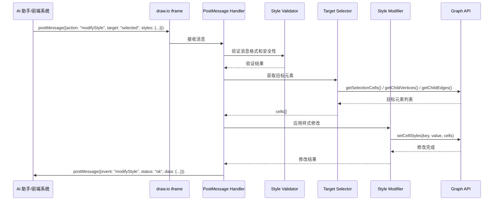
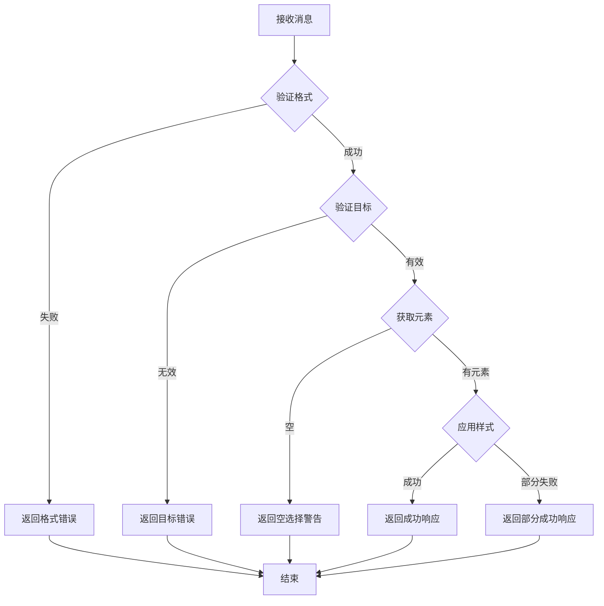

# 设计文档：图形样式修改功能

## 概述

本设计文档描述了如何在 draw.io 中实现通过 iframe postMessage 接收样式修改指令并自动应用到图形元素的功能。该功能允许外部系统（如 AI 助手）通过标准的浏览器 postMessage API 与嵌入的 draw.io iframe 通信，发送 JSON 格式的样式修改指令，draw.io 将解析指令并调用相应的 Graph API 来完成图形的样式修改。

### 设计目标

1. **简单集成**：前端系统只需发送 JSON 指令，无需了解 draw.io 内部实现
2. **灵活操作**：支持绝对值设置和相对值操作
3. **安全可靠**：验证消息来源和内容，防止恶意操作
4. **向后兼容**：不影响现有的 postMessage 处理逻辑
5. **可撤销**：所有操作都可以通过撤销功能恢复

### 技术栈

- **JavaScript**：draw.io 的主要开发语言
- **postMessage API**：浏览器标准的跨窗口通信机制
- **mxGraph API**：draw.io 底层的图形操作 API
- **现有插件系统**：扩展现有的 `mermaid-import.js` 插件

## 架构

### 系统架构图



### 组件关系

1. **PostMessage Handler**：消息接收和分发中心
2. **Style Validator**：消息格式和内容验证
3. **Target Selector**：目标元素选择器
4. **Style Modifier**：样式修改执行器
5. **Response Sender**：响应消息发送器

## 组件和接口

### 1. PostMessage Handler（消息处理器）

**职责**：
- 监听 window 的 message 事件
- 识别 `action: 'modifyStyle'` 消息
- 调用验证器验证消息
- 协调选择和修改流程
- 发送响应消息

**接口**：

```javascript
/**
 * 处理 modifyStyle 消息
 * @param {MessageEvent} evt - 浏览器 message 事件对象
 * @param {Object} data - 解析后的消息数据
 */
function handleModifyStyle(evt, data) {
    // 1. 验证消息格式
    // 2. 获取目标元素
    // 3. 应用样式修改
    // 4. 发送响应消息
}
```

**实现位置**：扩展 `src/main/webapp/plugins/mermaid-import.js`

### 2. Style Validator（样式验证器）

**职责**：
- 验证消息格式（必需字段）
- 验证 target 值的有效性
- 验证 styles 和 operations 的内容
- 验证属性值的类型和范围

**接口**：

```javascript
/**
 * 验证样式修改消息
 * @param {Object} data - 消息数据
 * @returns {{valid: boolean, error?: string, errorCode?: string}}
 */
function validateStyleMessage(data) {
    // 验证 target 字段
    // 验证 styles 或 operations 存在
    // 验证属性值类型
}
```

**验证规则**：
1. **target 验证**：必须是 'selected'、'edges'、'vertices' 或 'all'
2. **内容验证**：必须包含 styles 或 operations 至少一个
3. **属性验证**：属性值类型必须正确（颜色为字符串，数值为数字等）

### 3. Target Selector（目标选择器）

**职责**：
- 根据 target 值获取对应的图形元素
- 处理空选择的情况
- 过滤无效的 cell

**接口**：

```javascript
/**
 * 获取目标元素
 * @param {string} target - 目标选择器值
 * @param {mxGraph} graph - 图形对象
 * @returns {{cells: Array, error?: string}}
 */
function getTargetCells(target, graph) {
    switch (target) {
        case 'selected':
            return { cells: graph.getSelectionCells() };
        case 'edges':
            return { cells: graph.getChildEdges(graph.getDefaultParent()) };
        case 'vertices':
            return { cells: graph.getChildVertices(graph.getDefaultParent()) };
        case 'all':
            return { cells: graph.getChildCells(graph.getDefaultParent()) };
        default:
            return { cells: [], error: 'Invalid target: ' + target };
    }
}
```

### 4. Style Modifier（样式修改器）

**职责**：
- 应用绝对样式值
- 执行相对样式操作
- 处理批量修改
- 记录撤销历史

**接口**：

```javascript
/**
 * 应用样式修改
 * @param {Array} cells - 目标元素
 * @param {Object} styles - 绝对样式值
 * @param {Object} operations - 相对操作
 * @param {mxGraph} graph - 图形对象
 * @returns {{success: boolean, modifiedCount: number, errors: Array}}
 */
function applyStyleModifications(cells, styles, operations, graph) {
    var model = graph.getModel();
    model.beginUpdate();
    try {
        // 1. 应用绝对样式值
        if (styles) {
            applyAbsoluteStyles(cells, styles, graph);
        }
        // 2. 应用相对操作
        if (operations) {
            applyRelativeOperations(cells, operations, graph);
        }
    } finally {
        model.endUpdate();
    }
}

/**
 * 应用绝对样式值
 */
function applyAbsoluteStyles(cells, styles, graph) {
    for (var key in styles) {
        if (styles.hasOwnProperty(key)) {
            graph.setCellStyles(key, styles[key], cells);
        }
    }
}

/**
 * 应用相对操作
 */
function applyRelativeOperations(cells, operations, graph) {
    for (var key in operations) {
        if (operations.hasOwnProperty(key)) {
            var op = operations[key];
            applyOperation(cells, key, op.op, op.value, graph);
        }
    }
}

/**
 * 执行单个相对操作
 */
function applyOperation(cells, property, operation, value, graph) {
    for (var i = 0; i < cells.length; i++) {
        var cell = cells[i];
        var currentValue = parseFloat(graph.getCellStyle(cell)[property]) || 0;
        var newValue;
        
        switch (operation) {
            case 'set':
                newValue = value;
                break;
            case 'increase':
                newValue = currentValue + value;
                break;
            case 'decrease':
                newValue = currentValue - value;
                break;
            case 'multiply':
                newValue = currentValue * value;
                break;
        }
        
        // 应用范围限制
        newValue = clampValue(property, newValue);
        graph.setCellStyles(property, newValue, [cell]);
    }
}
```

### 5. Value Constraints（值约束）

**属性值范围定义**：

```javascript
var VALUE_CONSTRAINTS = {
    // 透明度属性：0-100
    opacity: { min: 0, max: 100 },
    fillOpacity: { min: 0, max: 100 },
    strokeOpacity: { min: 0, max: 100 },
    textOpacity: { min: 0, max: 100 },
    shadowOpacity: { min: 0, max: 100 },
    
    // 线条粗细：最小 0
    strokeWidth: { min: 0 },
    
    // 字体大小：最小 1
    fontSize: { min: 1 },
    
    // 圆角大小：0-100
    arcSize: { min: 0, max: 100 },
    
    // 旋转角度：0-360
    rotation: { min: 0, max: 360 },
    
    // 箭头大小：最小 0
    startSize: { min: 0 },
    endSize: { min: 0 }
};

/**
 * 限制值在有效范围内
 */
function clampValue(property, value) {
    var constraint = VALUE_CONSTRAINTS[property];
    if (!constraint) {
        return value;
    }
    if (constraint.min !== undefined && value < constraint.min) {
        return constraint.min;
    }
    if (constraint.max !== undefined && value > constraint.max) {
        return constraint.max;
    }
    return value;
}
```

### 6. Property Categories（属性分类）

```javascript
// 颜色属性（只支持绝对值设置）
var COLOR_PROPERTIES = [
    'fillColor', 'strokeColor', 'fontColor', 'gradientColor',
    'labelBackgroundColor', 'labelBorderColor', 'shadowColor', 'swimlaneFillColor'
];

// 数值属性（支持相对操作）
var NUMERIC_PROPERTIES = [
    'strokeWidth', 'fontSize', 'opacity', 'fillOpacity', 'strokeOpacity',
    'textOpacity', 'arcSize', 'startSize', 'endSize', 'spacing',
    'spacingTop', 'spacingBottom', 'spacingLeft', 'spacingRight', 'rotation'
];

// 开关属性（0 或 1）
var BOOLEAN_PROPERTIES = [
    'dashed', 'rounded', 'curved', 'shadow', 'startFill', 'endFill',
    'editable', 'movable', 'resizable', 'rotatable', 'deletable', 'bendable', 'foldable'
];

// 枚举属性
var ENUM_PROPERTIES = {
    align: ['left', 'center', 'right'],
    verticalAlign: ['top', 'middle', 'bottom'],
    labelPosition: ['left', 'center', 'right'],
    verticalLabelPosition: ['top', 'middle', 'bottom'],
    startArrow: ['none', 'classic', 'classicThin', 'block', 'blockThin', 'open', 'openThin', 'oval', 'diamond', 'diamondThin'],
    endArrow: ['none', 'classic', 'classicThin', 'block', 'blockThin', 'open', 'openThin', 'oval', 'diamond', 'diamondThin']
};

// 边专用属性
var EDGE_ONLY_PROPERTIES = [
    'startArrow', 'endArrow', 'startSize', 'endSize', 'startFill', 'endFill', 'curved'
];
```

## 数据模型

### 请求消息格式

```typescript
interface ModifyStyleRequest {
    action: 'modifyStyle';           // 必需：操作类型
    target: 'selected' | 'edges' | 'vertices' | 'all';  // 必需：目标选择器
    styles?: {                       // 可选：绝对样式值
        [key: string]: string | number;
    };
    operations?: {                   // 可选：相对操作
        [key: string]: {
            op: 'set' | 'increase' | 'decrease' | 'multiply';
            value: number;
        };
    };
}
```

**示例**：

```javascript
// 设置绝对样式值
{
    action: 'modifyStyle',
    target: 'selected',
    styles: {
        fillColor: '#FF0000',
        strokeWidth: 3,
        rounded: 1
    }
}

// 使用相对操作
{
    action: 'modifyStyle',
    target: 'edges',
    operations: {
        strokeWidth: { op: 'increase', value: 2 },
        opacity: { op: 'decrease', value: 20 }
    }
}

// 混合使用
{
    action: 'modifyStyle',
    target: 'selected',
    styles: {
        strokeColor: '#FF0000'
    },
    operations: {
        strokeWidth: { op: 'increase', value: 2 }
    }
}
```

### 响应消息格式

```typescript
interface ModifyStyleResponse {
    event: 'modifyStyle';            // 事件类型
    status: 'ok' | 'error';          // 状态
    error?: string;                  // 错误描述（status 为 error 时）
    errorCode?: string;              // 错误代码（status 为 error 时）
    data?: {                         // 成功时的额外数据
        modifiedCount: number;       // 修改的元素数量
        failedCount?: number;        // 失败的元素数量（部分失败时）
    };
}
```

**成功响应示例**：

```javascript
{
    event: 'modifyStyle',
    status: 'ok',
    data: {
        modifiedCount: 5
    }
}
```

**错误响应示例**：

```javascript
{
    event: 'modifyStyle',
    status: 'error',
    error: 'Invalid target: unknown',
    errorCode: 'INVALID_TARGET'
}
```

### 错误代码定义

| 错误代码 | 描述 | 触发条件 |
|---------|------|---------|
| `INVALID_FORMAT` | 消息格式无效 | 缺少必需字段或字段类型错误 |
| `INVALID_TARGET` | 无效的目标选择器 | target 不是有效值 |
| `NO_TARGET_CELLS` | 没有目标元素 | 目标选择器返回空集合 |
| `INVALID_PROPERTY` | 无效的属性名 | 属性名不被支持 |
| `INVALID_VALUE` | 无效的属性值 | 属性值类型或范围错误 |
| `INVALID_OPERATION` | 无效的操作类型 | op 不是有效值 |
| `UNSUPPORTED_OPERATION` | 不支持的操作 | 对颜色属性使用相对操作 |
| `ORIGIN_DENIED` | 来源被拒绝 | 消息来源不在允许列表中 |

## 正确性属性

*属性是一个特征或行为，应该在系统的所有有效执行中保持为真——本质上是关于系统应该做什么的形式化陈述。属性作为人类可读规范和机器可验证正确性保证之间的桥梁。*

### 属性 1：有效消息接受

*对于任何*包含 `action: 'modifyStyle'`、有效 `target` 值和至少一个 `styles` 或 `operations` 字段的消息，PostMessage Handler 应该接受并处理该消息。

**验证：需求 1.1, 1.5**

### 属性 2：无效消息拒绝

*对于任何*缺少 `target` 字段或同时缺少 `styles` 和 `operations` 字段的消息，系统应该拒绝处理并返回包含错误代码的错误响应。

**验证：需求 1.2, 1.3**

### 属性 3：目标选择器正确性

*对于任何*有效的 target 值（selected/edges/vertices/all），Target Selector 应该返回正确类型的元素集合：
- 'selected' 返回当前选中的元素
- 'edges' 只返回边元素
- 'vertices' 只返回顶点元素
- 'all' 返回所有元素

**验证：需求 2.1, 2.2, 2.3, 2.4**

### 属性 4：无效目标拒绝

*对于任何*不是 'selected'、'edges'、'vertices' 或 'all' 的 target 值，系统应该返回 `INVALID_TARGET` 错误。

**验证：需求 2.5**

### 属性 5：样式属性正确应用

*对于任何*有效的样式属性和值，当应用到目标元素后，该元素的对应样式属性应该等于设置的值。

**验证：需求 3.1, 3.2, 3.3, 3.4, 3.5, 3.6, 3.7, 3.8, 3.9**

### 属性 6：相对操作正确计算

*对于任何*数值属性和相对操作：
- `set` 操作后，属性值等于指定值
- `increase` 操作后，属性值等于原值加上指定值
- `decrease` 操作后，属性值等于原值减去指定值
- `multiply` 操作后，属性值等于原值乘以指定倍数

**验证：需求 4.1, 4.2, 4.3, 4.4**

### 属性 7：颜色属性操作限制

*对于任何*颜色属性（fillColor、strokeColor、fontColor 等），当尝试使用相对操作（increase/decrease/multiply）时，系统应该返回 `UNSUPPORTED_OPERATION` 错误。

**验证：需求 4.5**

### 属性 8：值范围限制

*对于任何*有范围限制的属性（如 opacity 0-100），当相对操作的结果超出有效范围时，系统应该将值限制在有效范围内。

**验证：需求 4.6**

### 属性 9：箭头属性边专用

*对于任何*箭头相关属性（startArrow、endArrow、startSize、endSize、startFill、endFill），当应用到非边元素时，系统应该忽略该属性而不报错。

**验证：需求 5.7**

### 属性 10：对齐值验证

*对于任何* `align` 属性值不是 'left'、'center' 或 'right'，或 `verticalAlign` 属性值不是 'top'、'middle' 或 'bottom' 时，系统应该返回 `INVALID_VALUE` 错误。

**验证：需求 6.5, 6.6**

### 属性 11：成功响应格式

*对于任何*成功的样式修改操作，系统应该发送包含 `event: 'modifyStyle'`、`status: 'ok'` 和 `data.modifiedCount` 的响应消息。

**验证：需求 7.1, 7.3**

### 属性 12：错误响应格式

*对于任何*失败的样式修改操作，系统应该发送包含 `event: 'modifyStyle'`、`status: 'error'`、`error` 和 `errorCode` 字段的响应消息。

**验证：需求 7.2, 7.4**

### 属性 13：批量样式原子性

*对于任何*包含多个样式属性的请求，所有属性应该在一次模型更新中应用，使得撤销操作可以一次性恢复所有属性。

**验证：需求 8.1, 9.3**

### 属性 14：样式和操作顺序

*对于任何*同时包含 `styles` 和 `operations` 的请求，系统应该先应用 `styles` 中的绝对值，再应用 `operations` 中的相对操作。

**验证：需求 8.3**

### 属性 15：撤销功能

*对于任何*成功的样式修改操作，执行撤销后，所有被修改元素的样式应该恢复到修改前的状态。

**验证：需求 9.1, 9.2**

### 属性 16：向后兼容性

*对于任何*现有的 postMessage action（如 `generateMermaid`、`importMermaid`、`insertMermaid`），添加新的 `modifyStyle` action 后，现有 action 应该继续正常工作。

**验证：需求 10.1, 10.2**

## 错误处理

### 错误处理策略

1. **验证阶段错误**：
   - 立即返回错误响应
   - 不进行后续处理

2. **选择阶段错误**：
   - 无效目标返回错误
   - 空选择返回警告

3. **修改阶段错误**：
   - 无效属性被忽略
   - 继续处理其他属性
   - 在响应中报告失败

### 错误处理流程图



## 测试策略

### 双重测试方法

本功能将采用**单元测试**和**基于属性的测试**相结合的方法，以确保全面的测试覆盖。

#### 单元测试

单元测试用于验证特定示例、边缘情况和错误条件：

1. **消息验证测试**：
   - 测试有效消息格式
   - 测试缺少必需字段的消息
   - 测试无效 target 值

2. **目标选择测试**：
   - 测试各种 target 值
   - 测试空选择情况

3. **样式应用测试**：
   - 测试各种样式属性
   - 测试相对操作
   - 测试值范围限制

4. **响应格式测试**：
   - 测试成功响应
   - 测试错误响应

#### 基于属性的测试

基于属性的测试用于验证跨所有输入的通用属性：

1. **输入验证属性**：
   - 生成随机有效/无效消息，验证验证逻辑

2. **样式应用属性**：
   - 生成随机样式值，验证应用正确性

3. **相对操作属性**：
   - 生成随机初始值和操作，验证计算正确性

4. **响应属性**：
   - 验证所有响应消息格式正确

### 测试框架

**JavaScript 测试框架**：
- **Jest**：用于单元测试和集成测试
- **fast-check**：用于基于属性的测试

**测试配置**：
- 每个属性测试至少运行 **100 次迭代**
- 每个测试必须引用设计文档中的属性
- 标签格式：`Feature: style-modification, Property {number}: {property_text}`

### 测试示例

#### 单元测试示例

```javascript
describe('Style Modification', () => {
    test('should apply fillColor to selected cells', () => {
        // 设置选中的 cells
        graph.setSelectionCells([cell1, cell2]);
        
        // 发送修改消息
        handleModifyStyle(mockEvent, {
            action: 'modifyStyle',
            target: 'selected',
            styles: { fillColor: '#FF0000' }
        });
        
        // 验证样式已应用
        expect(graph.getCellStyle(cell1).fillColor).toBe('#FF0000');
        expect(graph.getCellStyle(cell2).fillColor).toBe('#FF0000');
    });
});
```

#### 基于属性的测试示例

```javascript
const fc = require('fast-check');

describe('Property Tests', () => {
    // Feature: style-modification, Property 6: 相对操作正确计算
    test('Property 6: increase operation should add value to current', () => {
        fc.assert(
            fc.property(
                fc.integer({ min: 1, max: 100 }),  // 初始值
                fc.integer({ min: 1, max: 50 }),   // 增加值
                (initial, increment) => {
                    // 设置初始值
                    graph.setCellStyles('strokeWidth', initial, [cell]);
                    
                    // 应用 increase 操作
                    applyOperation([cell], 'strokeWidth', 'increase', increment, graph);
                    
                    // 验证结果
                    const result = parseFloat(graph.getCellStyle(cell).strokeWidth);
                    return result === initial + increment;
                }
            ),
            { numRuns: 100 }
        );
    });
});
```

## 实现细节

### 文件修改

**主要修改文件**：`src/main/webapp/plugins/mermaid-import.js`

**修改策略**：
1. 保留现有的所有处理逻辑
2. 添加新的 `modifyStyle` action 处理器
3. 添加样式验证和修改函数

### 代码结构

```javascript
// ========================================
// Style Modification Constants
// ========================================

var STYLE_ERROR_CODES = {
    INVALID_FORMAT: 'INVALID_FORMAT',
    INVALID_TARGET: 'INVALID_TARGET',
    NO_TARGET_CELLS: 'NO_TARGET_CELLS',
    INVALID_PROPERTY: 'INVALID_PROPERTY',
    INVALID_VALUE: 'INVALID_VALUE',
    INVALID_OPERATION: 'INVALID_OPERATION',
    UNSUPPORTED_OPERATION: 'UNSUPPORTED_OPERATION'
};

var VALID_TARGETS = ['selected', 'edges', 'vertices', 'all'];
var VALID_OPERATIONS = ['set', 'increase', 'decrease', 'multiply'];

// ========================================
// Style Modification Functions
// ========================================

/**
 * 验证样式修改消息
 */
function validateStyleMessage(data) {
    // 验证 target
    if (!data.target || VALID_TARGETS.indexOf(data.target) === -1) {
        return {
            valid: false,
            error: 'Invalid or missing target',
            errorCode: STYLE_ERROR_CODES.INVALID_TARGET
        };
    }
    
    // 验证 styles 或 operations 存在
    if (!data.styles && !data.operations) {
        return {
            valid: false,
            error: 'Missing styles or operations',
            errorCode: STYLE_ERROR_CODES.INVALID_FORMAT
        };
    }
    
    return { valid: true };
}

/**
 * 获取目标元素
 */
function getTargetCells(target, graph) {
    var parent = graph.getDefaultParent();
    
    switch (target) {
        case 'selected':
            return graph.getSelectionCells();
        case 'edges':
            return graph.getChildEdges(parent);
        case 'vertices':
            return graph.getChildVertices(parent);
        case 'all':
            return graph.getChildCells(parent);
        default:
            return [];
    }
}

/**
 * 应用样式修改
 */
function applyStyleModifications(cells, styles, operations, graph) {
    var model = graph.getModel();
    var modifiedCount = 0;
    var errors = [];
    
    model.beginUpdate();
    try {
        // 应用绝对样式值
        if (styles) {
            for (var key in styles) {
                if (styles.hasOwnProperty(key)) {
                    try {
                        // 过滤边专用属性
                        var filteredCells = filterCellsForProperty(cells, key, graph);
                        if (filteredCells.length > 0) {
                            graph.setCellStyles(key, styles[key], filteredCells);
                            modifiedCount = Math.max(modifiedCount, filteredCells.length);
                        }
                    } catch (e) {
                        errors.push({ property: key, error: e.message });
                    }
                }
            }
        }
        
        // 应用相对操作
        if (operations) {
            for (var key in operations) {
                if (operations.hasOwnProperty(key)) {
                    var op = operations[key];
                    try {
                        // 验证操作类型
                        if (VALID_OPERATIONS.indexOf(op.op) === -1) {
                            errors.push({ property: key, error: 'Invalid operation: ' + op.op });
                            continue;
                        }
                        
                        // 检查颜色属性不支持相对操作
                        if (COLOR_PROPERTIES.indexOf(key) !== -1 && op.op !== 'set') {
                            errors.push({ property: key, error: 'Color properties only support set operation' });
                            continue;
                        }
                        
                        var filteredCells = filterCellsForProperty(cells, key, graph);
                        applyOperationToCells(filteredCells, key, op.op, op.value, graph);
                        modifiedCount = Math.max(modifiedCount, filteredCells.length);
                    } catch (e) {
                        errors.push({ property: key, error: e.message });
                    }
                }
            }
        }
    } finally {
        model.endUpdate();
    }
    
    return {
        success: errors.length === 0,
        modifiedCount: modifiedCount,
        errors: errors
    };
}
```

### 主处理函数

```javascript
/**
 * 处理 modifyStyle 消息
 */
function handleModifyStyle(evt, data) {
    log('debug', 'Handling modifyStyle action');
    
    // 1. 验证消息
    var validation = validateStyleMessage(data);
    if (!validation.valid) {
        sendStyleResponse(evt, false, validation.error, validation.errorCode);
        return;
    }
    
    // 2. 获取目标元素
    var graph = ui.editor.graph;
    var cells = getTargetCells(data.target, graph);
    
    if (!cells || cells.length === 0) {
        sendStyleResponse(evt, false, 'No target cells found', STYLE_ERROR_CODES.NO_TARGET_CELLS);
        return;
    }
    
    // 3. 应用样式修改
    try {
        var result = applyStyleModifications(cells, data.styles, data.operations, graph);
        
        // 4. 标记为已修改
        if (ui.editor && typeof ui.editor.setModified === 'function') {
            ui.editor.setModified(true);
        }
        
        // 5. 发送响应
        if (result.success) {
            sendStyleResponse(evt, true, null, null, {
                modifiedCount: result.modifiedCount
            });
        } else {
            sendStyleResponse(evt, true, null, null, {
                modifiedCount: result.modifiedCount,
                errors: result.errors
            });
        }
        
        log('info', 'Style modification completed', {
            modifiedCount: result.modifiedCount,
            errors: result.errors
        });
        
    } catch (e) {
        log('error', 'Style modification failed', e);
        sendStyleResponse(evt, false, e.message || 'Style modification failed', STYLE_ERROR_CODES.INVALID_FORMAT);
    }
}

/**
 * 发送样式修改响应
 */
function sendStyleResponse(evt, success, error, errorCode, data) {
    try {
        if (!evt || !evt.source) {
            log('error', 'Cannot send response: invalid event or source');
            return;
        }
        
        var response = {
            event: 'modifyStyle',
            status: success ? 'ok' : 'error'
        };
        
        if (!success) {
            response.error = error || 'Unknown error';
            response.errorCode = errorCode || STYLE_ERROR_CODES.INVALID_FORMAT;
        }
        
        if (data) {
            response.data = data;
        }
        
        evt.source.postMessage(JSON.stringify(response), '*');
        
        if (success) {
            log('debug', 'Style response sent', response);
        } else {
            log('error', 'Style error response sent', response);
        }
    } catch (e) {
        log('error', 'Failed to send style response', e);
    }
}
```

### 消息路由更新

```javascript
// 在 handleMessage 函数中添加路由
function handleMessage(evt) {
    var data = evt.data;
    
    if (typeof data === 'string') {
        try {
            data = JSON.parse(data);
        } catch (e) {
            return;
        }
    }
    
    if (data == null || data.action == null) {
        return;
    }
    
    // 路由到 modifyStyle 处理器（新增）
    if (data.action === 'modifyStyle') {
        handleModifyStyle(evt, data);
        return;
    }
    
    // 保留现有的处理逻辑...
    if (data.action === 'generateMermaid') {
        handleGenerateMermaid(evt, data);
        return;
    }
    
    // ... 其他现有处理器
}
```

## 前端集成示例

### 基本用法

```javascript
// 获取 draw.io iframe
const iframe = document.getElementById('drawio-iframe');

// 监听响应
window.addEventListener('message', function(evt) {
    if (evt.source !== iframe.contentWindow) return;
    
    const data = typeof evt.data === 'string' ? JSON.parse(evt.data) : evt.data;
    
    if (data.event === 'modifyStyle') {
        if (data.status === 'ok') {
            console.log('样式修改成功，修改了', data.data.modifiedCount, '个元素');
        } else {
            console.error('样式修改失败：', data.error);
        }
    }
});

// 修改选中元素的颜色
function changeSelectedColor(color) {
    iframe.contentWindow.postMessage(JSON.stringify({
        action: 'modifyStyle',
        target: 'selected',
        styles: {
            fillColor: color
        }
    }), '*');
}

// 加粗所有线条
function thickenAllEdges() {
    iframe.contentWindow.postMessage(JSON.stringify({
        action: 'modifyStyle',
        target: 'edges',
        operations: {
            strokeWidth: { op: 'increase', value: 2 }
        }
    }), '*');
}

// 组合修改
function applyComplexStyle() {
    iframe.contentWindow.postMessage(JSON.stringify({
        action: 'modifyStyle',
        target: 'selected',
        styles: {
            fillColor: '#0000FF',
            rounded: 1,
            shadow: 1
        },
        operations: {
            strokeWidth: { op: 'multiply', value: 2 },
            fontSize: { op: 'increase', value: 4 }
        }
    }), '*');
}
```

### AI 助手集成示例

```javascript
// AI 生成的样式修改指令处理
function executeAIStyleCommand(command) {
    // command 是 AI 根据用户自然语言生成的 JSON 对象
    // 例如用户说"把选中的改成红色"，AI 生成：
    // { action: 'modifyStyle', target: 'selected', styles: { fillColor: '#FF0000' } }
    
    iframe.contentWindow.postMessage(JSON.stringify(command), '*');
}

// 示例：处理用户输入
async function handleUserInput(userText) {
    // 调用 AI API 将自然语言转换为样式指令
    const response = await fetch('/api/ai/style-command', {
        method: 'POST',
        body: JSON.stringify({ text: userText })
    });
    
    const command = await response.json();
    
    // 执行样式修改
    executeAIStyleCommand(command);
}
```

## 安全考虑

### 1. Origin 验证

复用现有的 origin 验证机制，确保只处理来自允许来源的消息。

### 2. 输入验证

- 验证所有输入字段的类型和范围
- 忽略未知的属性名
- 限制属性值在有效范围内

### 3. 防止恶意操作

- 不执行任何代码字符串
- 只处理预定义的属性和操作
- 使用白名单而非黑名单

## 性能考虑

### 1. 批量操作

使用 `model.beginUpdate()` 和 `model.endUpdate()` 包装所有修改，确保：
- 只触发一次视图更新
- 支持原子撤销

### 2. 选择器优化

- 缓存常用的选择结果
- 避免重复遍历图形

### 3. 样式应用优化

- 使用 `setCellStyles` 批量设置样式
- 避免逐个 cell 单独设置

## 兼容性

### 浏览器兼容性

与现有 mermaid-import.js 插件保持一致的浏览器支持。

### 向后兼容性

- 不修改现有的消息处理逻辑
- 新功能作为独立的 action 添加
- 不改变现有的 API 签名
