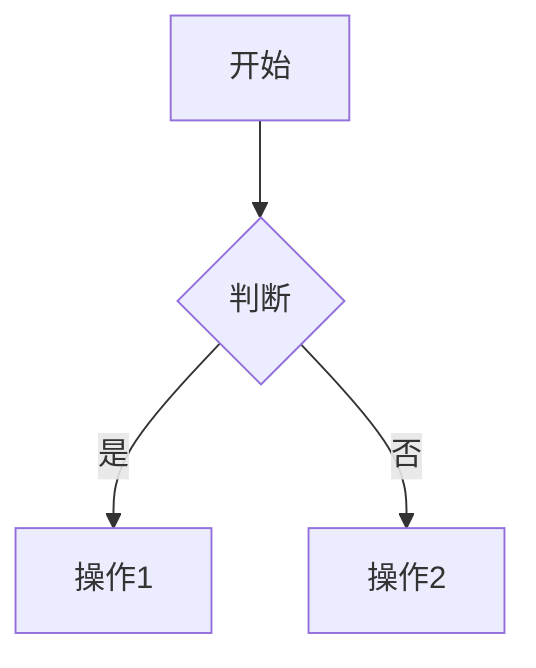
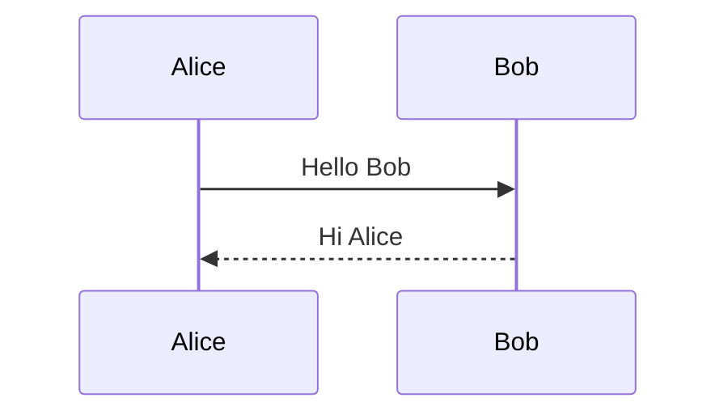
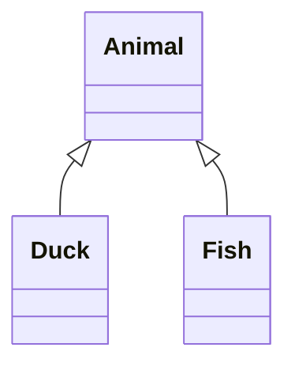

# Mermaid iframe 集成 API 文档

## 概述

本文档描述了 draw.io 的 Mermaid iframe 集成功能的 API 规范。该功能允许外部前端系统通过浏览器的 `postMessage` API 向嵌入的 draw.io iframe 发送 Mermaid 文本，draw.io 将自动解析并将生成的图表插入到画布中。

## 快速开始

```javascript
// 获取 iframe 引用
const iframe = document.getElementById('drawio-iframe');

// 发送 Mermaid 生成请求
iframe.contentWindow.postMessage(JSON.stringify({
    action: 'generateMermaid',
    mermaid: 'flowchart TD\n    A[开始] --> B[结束]'
}), '*');

// 监听响应
window.addEventListener('message', function(evt) {
    const data = JSON.parse(evt.data);
    if (data.event === 'generateMermaid') {
        if (data.status === 'ok') {
            console.log('图表生成成功！');
        } else {
            console.error('错误：', data.error);
        }
    }
});
```

## 消息格式

### 请求消息

#### 基本格式

```typescript
interface GenerateMermaidRequest {
    action: 'generateMermaid';  // 必需：操作类型
    mermaid: string;             // 必需：Mermaid 语法文本
    options?: GenerateOptions;   // 可选：额外配置
}
```

#### 字段说明

| 字段 | 类型 | 必需 | 描述 |
|------|------|------|------|
| `action` | string | 是 | 必须为 `'generateMermaid'` |
| `mermaid` | string | 是 | 符合 Mermaid 语法的文本字符串 |
| `options` | object | 否 | 额外配置选项（见下文） |

#### 配置选项 (options)

```typescript
interface GenerateOptions {
    position?: {
        x: number;      // X 坐标
        y: number;      // Y 坐标
    };
    scale?: number;     // 缩放比例（0.1 - 10.0）
    select?: boolean;   // 是否自动选中（默认 true）
    center?: boolean;   // 是否居中显示（默认 false）
    editable?: boolean; // 是否生成原生可编辑图形（默认 true）
}
```

| 选项 | 类型 | 默认值 | 描述 |
|------|------|--------|------|
| `position` | object | `{x: 20, y: 20}` | 图表插入位置 |
| `position.x` | number | 20 | X 轴坐标（像素） |
| `position.y` | number | 20 | Y 轴坐标（像素） |
| `scale` | number | 1.0 | 缩放比例，范围 0.1 - 10.0 |
| `select` | boolean | true | 插入后是否自动选中图表 |
| `center` | boolean | false | 是否将图表居中显示 |
| `editable` | boolean | true | 是否生成原生可编辑图形（见下文说明） |

#### editable 选项说明

- `editable: true`（默认）：将 Mermaid 转换为原生 Draw.io 图形，可以自由编辑每个节点
- `editable: false`：生成 Mermaid 数据图形，双击可编辑 Mermaid 源码

**支持原生编辑的图表类型**：
- flowchart / graph（流程图）
- sequenceDiagram（时序图）
- classDiagram（类图）
- stateDiagram / stateDiagram-v2（状态图）
- erDiagram（ER图）
- gitGraph（Git图）
- mindmap（思维导图）
- journey（用户旅程图）

**不支持原生编辑的图表类型**（即使设置 `editable: true` 也会生成 Mermaid 数据图形）：
- gantt（甘特图）
- pie（饼图）
- 其他未列出的类型

#### 请求示例

**基本请求**：
```javascript
{
    action: 'generateMermaid',
    mermaid: 'flowchart TD\n    A[开始] --> B[结束]'
}
```

**带位置和缩放**：
```javascript
{
    action: 'generateMermaid',
    mermaid: 'sequenceDiagram\n    Alice->>Bob: Hello',
    options: {
        position: { x: 100, y: 100 },
        scale: 1.5,
        select: true
    }
}
```

**复杂流程图**：
```javascript
{
    action: 'generateMermaid',
    mermaid: `flowchart TD
    A[开始] --> B{判断条件}
    B -->|是| C[执行操作1]
    B -->|否| D[执行操作2]
    C --> E[结束]
    D --> E`,
    options: {
        position: { x: 50, y: 50 },
        scale: 1.2
    }
}
```

### 响应消息

#### 基本格式

```typescript
interface GenerateMermaidResponse {
    event: 'generateMermaid';    // 事件类型
    status: 'ok' | 'error';      // 状态
    error?: string;              // 错误描述（仅在 status 为 'error' 时）
    errorCode?: string;          // 错误代码（仅在 status 为 'error' 时）
    data?: ResponseData;         // 成功时的额外数据（可选）
}
```

#### 字段说明

| 字段 | 类型 | 描述 |
|------|------|------|
| `event` | string | 固定为 `'generateMermaid'` |
| `status` | string | `'ok'` 表示成功，`'error'` 表示失败 |
| `error` | string | 错误描述信息（仅在失败时） |
| `errorCode` | string | 错误代码（仅在失败时，见错误代码表） |
| `data` | object | 成功时的额外数据（可选） |

#### 成功响应数据 (data)

```typescript
interface ResponseData {
    cellCount?: number;  // 插入的图形元素数量
}
```

#### 响应示例

**成功响应**：
```javascript
{
    event: 'generateMermaid',
    status: 'ok',
    data: {
        cellCount: 5
    }
}
```

**错误响应**：
```javascript
{
    event: 'generateMermaid',
    status: 'error',
    error: 'Invalid Mermaid syntax at line 2: unexpected token',
    errorCode: 'PARSE_ERROR'
}
```

## 错误代码

### 错误代码表

| 错误代码 | HTTP 类比 | 描述 | 可能原因 |
|---------|----------|------|---------|
| `INVALID_FORMAT` | 400 | 消息格式无效 | 缺少必需字段或字段类型错误 |
| `EMPTY_MERMAID` | 400 | Mermaid 文本为空 | mermaid 字段为空字符串或仅包含空白 |
| `PARSE_ERROR` | 422 | Mermaid 解析失败 | Mermaid 语法错误 |
| `UNSUPPORTED_TYPE` | 422 | 不支持的图表类型 | Mermaid 图表类型不被支持 |
| `TIMEOUT` | 408 | 解析超时 | 解析时间超过 10 秒 |
| `INSERT_FAILED` | 500 | 插入失败 | 无法将图表插入到画布 |
| `ORIGIN_DENIED` | 403 | 来源被拒绝 | 消息来源不在允许列表中 |
| `SIZE_EXCEEDED` | 413 | 消息过大 | 消息大小超过 1MB |
| `XSS_DETECTED` | 403 | 检测到 XSS 攻击 | 消息内容包含危险脚本 |
| `UNSUPPORTED_BROWSER` | 501 | 浏览器不支持 | 浏览器缺少必需的 API |

### 错误处理示例

```javascript
window.addEventListener('message', function(evt) {
    const data = JSON.parse(evt.data);
    
    if (data.event === 'generateMermaid') {
        if (data.status === 'error') {
            switch (data.errorCode) {
                case 'PARSE_ERROR':
                    console.error('Mermaid 语法错误：', data.error);
                    // 显示语法错误提示
                    break;
                case 'TIMEOUT':
                    console.error('解析超时，请简化图表');
                    break;
                case 'ORIGIN_DENIED':
                    console.error('安全错误：来源被拒绝');
                    break;
                default:
                    console.error('未知错误：', data.error);
            }
        }
    }
});
```

## 配置选项

### iframe URL 参数

可以通过 URL 参数配置 draw.io iframe 的行为：

```html
<iframe 
    src="https://app.diagrams.net/?embed=1&proto=json&allowedOrigins=https://example.com&debugMode=true"
    width="100%" 
    height="600">
</iframe>
```

#### 可用参数

| 参数 | 类型 | 默认值 | 描述 |
|------|------|--------|------|
| `embed` | number | 0 | 设置为 1 启用嵌入模式 |
| `proto` | string | - | 设置为 `json` 启用 JSON 协议 |
| `allowedOrigins` | string | `*` | 允许的消息来源，逗号分隔 |
| `debugMode` | boolean | false | 启用调试模式，输出详细日志 |
| `spin` | number | 0 | 设置为 1 显示加载动画 |

#### 参数示例

**生产环境配置**（限制来源）：
```
https://app.diagrams.net/?embed=1&proto=json&allowedOrigins=https://app.example.com,https://example.com
```

**开发环境配置**（启用调试）：
```
https://app.diagrams.net/?embed=1&proto=json&debugMode=true
```

### 全局配置对象

在加载 draw.io iframe 之前，可以设置全局配置对象：

```javascript
window.DRAWIO_CONFIG = {
    allowedOrigins: ['https://example.com', 'https://app.example.com'],
    debugMode: false,
    parseTimeout: 10000,      // 解析超时时间（毫秒）
    maxMessageSize: 1048576   // 最大消息大小（字节，1MB）
};
```

#### 配置项说明

| 配置项 | 类型 | 默认值 | 描述 |
|--------|------|--------|------|
| `allowedOrigins` | string[] | `['*']` | 允许的消息来源列表 |
| `debugMode` | boolean | false | 是否启用调试模式 |
| `parseTimeout` | number | 10000 | 解析超时时间（毫秒） |
| `maxMessageSize` | number | 1048576 | 最大消息大小（字节） |

## 支持的 Mermaid 图表类型

draw.io 支持以下 Mermaid 图表类型：

- **Flowchart**（流程图）
- **Sequence Diagram**（时序图）
- **Class Diagram**（类图）
- **State Diagram**（状态图）
- **Entity Relationship Diagram**（实体关系图）
- **User Journey**（用户旅程图）
- **Gantt**（甘特图）
- **Pie Chart**（饼图）
- **Git Graph**（Git 图）

### 示例

**流程图**：


**时序图**：


**类图**：


## 安全性

### Origin 验证

为了安全起见，建议在生产环境中配置允许的 origin 列表：

```javascript
// 方法 1：URL 参数
const iframeSrc = 'https://app.diagrams.net/?embed=1&proto=json&allowedOrigins=https://example.com';

// 方法 2：全局配置
window.DRAWIO_CONFIG = {
    allowedOrigins: ['https://example.com']
};
```

### 内容安全

系统会自动检测和拒绝包含以下内容的消息：
- `<script>` 标签
- `javascript:` 协议
- 事件处理器（如 `onclick`）
- `<iframe>` 标签

### 消息大小限制

为防止 DoS 攻击，消息大小限制为 1MB。超过此限制的消息将被拒绝。

## 浏览器兼容性

### 支持的浏览器

- Chrome 90+
- Firefox 88+
- Safari 14+
- Edge 90+

### 必需的浏览器 API

- `window.postMessage`
- `structuredClone`
- `Promise`

### 兼容性检测

系统会自动检测浏览器兼容性，不支持的浏览器将收到 `UNSUPPORTED_BROWSER` 错误。

## 性能考虑

### 解析超时

- 默认超时时间：10 秒
- 可通过配置调整
- 超时后返回 `TIMEOUT` 错误

### 消息大小

- 建议保持 Mermaid 文本在 100KB 以内
- 最大限制：1MB
- 大型图表可能影响性能

### 最佳实践

1. **避免过于复杂的图表**：将大型图表拆分为多个小图表
2. **使用合理的超时设置**：根据图表复杂度调整超时时间
3. **批量操作**：如需插入多个图表，考虑分批处理

## 版本信息

- **API 版本**：1.0.0
- **最后更新**：2024-12
- **兼容性**：draw.io 版本 22.0.0+

## 相关资源

- [Mermaid 官方文档](https://mermaid.js.org/)
- [draw.io 官方网站](https://www.diagrams.net/)
- [集成指南](./MERMAID_IFRAME_INTEGRATION_GUIDE.md)
- [故障排查指南](./MERMAID_IFRAME_TROUBLESHOOTING.md)
