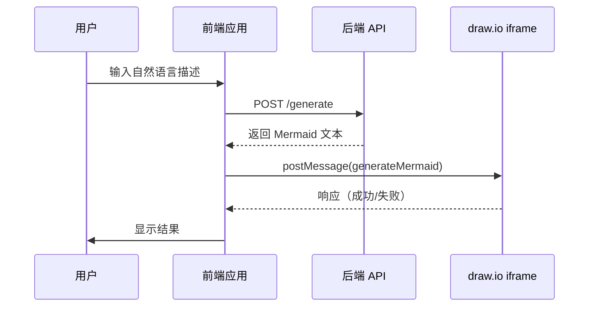

# Mermaid iframe 集成指南

## 概述

本指南将帮助您将 draw.io 的 Mermaid iframe 集成功能集成到您的前端应用中。通过这个功能，您可以让用户通过自然语言描述生成图表，后端将其转换为 Mermaid 语法，然后自动在 draw.io 中生成可视化图表。

## 集成流程



## 快速开始

### 步骤 1：嵌入 draw.io iframe

在您的 HTML 页面中添加 draw.io iframe：

```html
<!DOCTYPE html>
<html>
<head>
    <title>我的应用 - 图表生成</title>
</head>
<body>
    <iframe 
        id="drawio-iframe"
        src="https://app.diagrams.net/?embed=1&proto=json&spin=1"
        width="100%" 
        height="600"
        frameborder="0">
    </iframe>
</body>
</html>
```

**重要参数说明**：
- `embed=1`：启用嵌入模式
- `proto=json`：启用 JSON 协议
- `spin=1`：显示加载动画

### 步骤 2：添加消息监听器

监听来自 draw.io 的响应消息：

```javascript
window.addEventListener('message', function(evt) {
    // 确保消息来自 draw.io iframe
    const iframe = document.getElementById('drawio-iframe');
    if (evt.source !== iframe.contentWindow) {
        return;
    }
    
    // 解析消息数据
    let data;
    try {
        data = typeof evt.data === 'string' ? JSON.parse(evt.data) : evt.data;
    } catch (e) {
        console.error('无法解析消息：', e);
        return;
    }
    
    // 处理 generateMermaid 响应
    if (data.event === 'generateMermaid') {
        if (data.status === 'ok') {
            console.log('图表生成成功！');
            alert('图表已成功插入到画布中！');
        } else {
            console.error('图表生成失败：', data.error);
            alert('错误：' + data.error);
        }
    }
});
```

### 步骤 3：发送 Mermaid 生成请求

当您从后端获取到 Mermaid 文本后，发送给 draw.io：

```javascript
function generateDiagram(mermaidText) {
    const iframe = document.getElementById('drawio-iframe');
    
    // 构造请求消息
    const message = {
        action: 'generateMermaid',
        mermaid: mermaidText,
        options: {
            position: { x: 50, y: 50 },
            select: true
        }
    };
    
    // 发送消息
    iframe.contentWindow.postMessage(JSON.stringify(message), '*');
}

// 使用示例
const mermaidText = `flowchart TD
    A[开始] --> B{判断条件}
    B -->|是| C[执行操作]
    B -->|否| D[跳过]
    C --> E[结束]
    D --> E`;

generateDiagram(mermaidText);
```

## 完整示例

### HTML + Vanilla JavaScript

```html
<!DOCTYPE html>
<html lang="zh-CN">
<head>
    <meta charset="UTF-8">
    <meta name="viewport" content="width=device-width, initial-scale=1.0">
    <title>Draw.io Mermaid 集成示例</title>
    <style>
        body {
            font-family: Arial, sans-serif;
            margin: 0;
            padding: 20px;
        }
        .container {
            max-width: 1200px;
            margin: 0 auto;
        }
        .input-section {
            margin-bottom: 20px;
        }
        textarea {
            width: 100%;
            height: 200px;
            padding: 10px;
            font-family: monospace;
            font-size: 14px;
            border: 1px solid #ccc;
            border-radius: 4px;
        }
        button {
            padding: 10px 20px;
            font-size: 16px;
            background-color: #007bff;
            color: white;
            border: none;
            border-radius: 4px;
            cursor: pointer;
        }
        button:hover {
            background-color: #0056b3;
        }
        .status {
            margin-top: 10px;
            padding: 10px;
            border-radius: 4px;
        }
        .status.success {
            background-color: #d4edda;
            color: #155724;
        }
        .status.error {
            background-color: #f8d7da;
            color: #721c24;
        }
        iframe {
            border: 1px solid #ccc;
            border-radius: 4px;
        }
    </style>
</head>
<body>
    <div class="container">
        <h1>Draw.io Mermaid 集成示例</h1>
        
        <div class="input-section">
            <h2>输入 Mermaid 文本</h2>
            <textarea id="mermaid-input">flowchart TD
    A[开始] --> B{判断条件}
    B -->|是| C[执行操作1]
    B -->|否| D[执行操作2]
    C --> E[结束]
    D --> E</textarea>
            <br><br>
            <button onclick="generateDiagram()">生成图表</button>
            <div id="status"></div>
        </div>
        
        <h2>Draw.io 画布</h2>
        <iframe 
            id="drawio-iframe"
            src="https://app.diagrams.net/?embed=1&proto=json&spin=1"
            width="100%" 
            height="600"
            frameborder="0">
        </iframe>
    </div>

    <script>
        const iframe = document.getElementById('drawio-iframe');
        const statusDiv = document.getElementById('status');
        
        // 监听来自 draw.io 的响应
        window.addEventListener('message', function(evt) {
            if (evt.source !== iframe.contentWindow) {
                return;
            }
            
            let data;
            try {
                data = typeof evt.data === 'string' ? JSON.parse(evt.data) : evt.data;
            } catch (e) {
                return;
            }
            
            if (data.event === 'generateMermaid') {
                if (data.status === 'ok') {
                    showStatus('success', '✓ 图表生成成功！插入了 ' + (data.data?.cellCount || 0) + ' 个元素。');
                } else {
                    showStatus('error', '✗ 错误：' + data.error + ' (代码: ' + data.errorCode + ')');
                }
            }
        });
        
        // 生成图表
        function generateDiagram() {
            const mermaidText = document.getElementById('mermaid-input').value;
            
            if (!mermaidText.trim()) {
                showStatus('error', '请输入 Mermaid 文本');
                return;
            }
            
            showStatus('info', '正在生成图表...');
            
            iframe.contentWindow.postMessage(JSON.stringify({
                action: 'generateMermaid',
                mermaid: mermaidText,
                options: {
                    position: { x: 50, y: 50 },
                    select: true
                }
            }), '*');
        }
        
        // 显示状态消息
        function showStatus(type, message) {
            statusDiv.className = 'status ' + type;
            statusDiv.textContent = message;
            statusDiv.style.display = 'block';
        }
    </script>
</body>
</html>
```

### React 集成

```jsx
import React, { useRef, useEffect, useState } from 'react';

function DrawioMermaidIntegration() {
    const iframeRef = useRef(null);
    const [mermaidText, setMermaidText] = useState(`flowchart TD
    A[开始] --> B{判断条件}
    B -->|是| C[执行操作1]
    B -->|否| D[执行操作2]
    C --> E[结束]
    D --> E`);
    const [status, setStatus] = useState({ type: '', message: '' });

    useEffect(() => {
        const handleMessage = (evt) => {
            if (evt.source !== iframeRef.current?.contentWindow) {
                return;
            }

            let data;
            try {
                data = typeof evt.data === 'string' ? JSON.parse(evt.data) : evt.data;
            } catch (e) {
                return;
            }

            if (data.event === 'generateMermaid') {
                if (data.status === 'ok') {
                    setStatus({
                        type: 'success',
                        message: `✓ 图表生成成功！插入了 ${data.data?.cellCount || 0} 个元素。`
                    });
                } else {
                    setStatus({
                        type: 'error',
                        message: `✗ 错误：${data.error} (代码: ${data.errorCode})`
                    });
                }
            }
        };

        window.addEventListener('message', handleMessage);
        return () => window.removeEventListener('message', handleMessage);
    }, []);

    const generateDiagram = () => {
        if (!mermaidText.trim()) {
            setStatus({ type: 'error', message: '请输入 Mermaid 文本' });
            return;
        }

        setStatus({ type: 'info', message: '正在生成图表...' });

        iframeRef.current?.contentWindow.postMessage(
            JSON.stringify({
                action: 'generateMermaid',
                mermaid: mermaidText,
                options: {
                    position: { x: 50, y: 50 },
                    select: true
                }
            }),
            '*'
        );
    };

    return (
        <div style={{ padding: '20px', maxWidth: '1200px', margin: '0 auto' }}>
            <h1>Draw.io Mermaid 集成示例</h1>
            
            <div style={{ marginBottom: '20px' }}>
                <h2>输入 Mermaid 文本</h2>
                <textarea
                    value={mermaidText}
                    onChange={(e) => setMermaidText(e.target.value)}
                    rows={10}
                    style={{
                        width: '100%',
                        padding: '10px',
                        fontFamily: 'monospace',
                        fontSize: '14px',
                        border: '1px solid #ccc',
                        borderRadius: '4px'
                    }}
                />
                <br /><br />
                <button
                    onClick={generateDiagram}
                    style={{
                        padding: '10px 20px',
                        fontSize: '16px',
                        backgroundColor: '#007bff',
                        color: 'white',
                        border: 'none',
                        borderRadius: '4px',
                        cursor: 'pointer'
                    }}
                >
                    生成图表
                </button>
                {status.message && (
                    <div
                        style={{
                            marginTop: '10px',
                            padding: '10px',
                            borderRadius: '4px',
                            backgroundColor: status.type === 'success' ? '#d4edda' : '#f8d7da',
                            color: status.type === 'success' ? '#155724' : '#721c24'
                        }}
                    >
                        {status.message}
                    </div>
                )}
            </div>
            
            <h2>Draw.io 画布</h2>
            <iframe
                ref={iframeRef}
                src="https://app.diagrams.net/?embed=1&proto=json&spin=1"
                width="100%"
                height="600"
                frameBorder="0"
                style={{ border: '1px solid #ccc', borderRadius: '4px' }}
            />
        </div>
    );
}

export default DrawioMermaidIntegration;
```

### Vue.js 集成

```vue
<template>
  <div class="container">
    <h1>Draw.io Mermaid 集成示例</h1>
    
    <div class="input-section">
      <h2>输入 Mermaid 文本</h2>
      <textarea
        v-model="mermaidText"
        rows="10"
        class="mermaid-input"
      ></textarea>
      <br><br>
      <button @click="generateDiagram" class="generate-btn">
        生成图表
      </button>
      <div v-if="status.message" :class="['status', status.type]">
        {{ status.message }}
      </div>
    </div>
    
    <h2>Draw.io 画布</h2>
    <iframe
      ref="drawioIframe"
      src="https://app.diagrams.net/?embed=1&proto=json&spin=1"
      width="100%"
      height="600"
      frameborder="0"
      class="drawio-iframe"
    ></iframe>
  </div>
</template>

<script>
export default {
  name: 'DrawioMermaidIntegration',
  data() {
    return {
      mermaidText: `flowchart TD
    A[开始] --> B{判断条件}
    B -->|是| C[执行操作1]
    B -->|否| D[执行操作2]
    C --> E[结束]
    D --> E`,
      status: { type: '', message: '' }
    };
  },
  mounted() {
    window.addEventListener('message', this.handleMessage);
  },
  beforeUnmount() {
    window.removeEventListener('message', this.handleMessage);
  },
  methods: {
    handleMessage(evt) {
      if (evt.source !== this.$refs.drawioIframe?.contentWindow) {
        return;
      }

      let data;
      try {
        data = typeof evt.data === 'string' ? JSON.parse(evt.data) : evt.data;
      } catch (e) {
        return;
      }

      if (data.event === 'generateMermaid') {
        if (data.status === 'ok') {
          this.status = {
            type: 'success',
            message: `✓ 图表生成成功！插入了 ${data.data?.cellCount || 0} 个元素。`
          };
        } else {
          this.status = {
            type: 'error',
            message: `✗ 错误：${data.error} (代码: ${data.errorCode})`
          };
        }
      }
    },
    generateDiagram() {
      if (!this.mermaidText.trim()) {
        this.status = { type: 'error', message: '请输入 Mermaid 文本' };
        return;
      }

      this.status = { type: 'info', message: '正在生成图表...' };

      this.$refs.drawioIframe?.contentWindow.postMessage(
        JSON.stringify({
          action: 'generateMermaid',
          mermaid: this.mermaidText,
          options: {
            position: { x: 50, y: 50 },
            select: true
          }
        }),
        '*'
      );
    }
  }
};
</script>

<style scoped>
.container {
  padding: 20px;
  max-width: 1200px;
  margin: 0 auto;
}
.input-section {
  margin-bottom: 20px;
}
.mermaid-input {
  width: 100%;
  padding: 10px;
  font-family: monospace;
  font-size: 14px;
  border: 1px solid #ccc;
  border-radius: 4px;
}
.generate-btn {
  padding: 10px 20px;
  font-size: 16px;
  background-color: #007bff;
  color: white;
  border: none;
  border-radius: 4px;
  cursor: pointer;
}
.generate-btn:hover {
  background-color: #0056b3;
}
.status {
  margin-top: 10px;
  padding: 10px;
  border-radius: 4px;
}
.status.success {
  background-color: #d4edda;
  color: #155724;
}
.status.error {
  background-color: #f8d7da;
  color: #721c24;
}
.drawio-iframe {
  border: 1px solid #ccc;
  border-radius: 4px;
}
</style>
```

## 高级用法

### 1. 自定义插入位置

```javascript
// 在指定位置插入图表
iframe.contentWindow.postMessage(JSON.stringify({
    action: 'generateMermaid',
    mermaid: mermaidText,
    options: {
        position: { x: 200, y: 150 }  // 自定义坐标
    }
}), '*');
```

### 2. 缩放图表

```javascript
// 插入时缩放图表
iframe.contentWindow.postMessage(JSON.stringify({
    action: 'generateMermaid',
    mermaid: mermaidText,
    options: {
        scale: 1.5  // 放大 1.5 倍
    }
}), '*');
```

### 3. 禁用自动选中

```javascript
// 插入后不自动选中图表
iframe.contentWindow.postMessage(JSON.stringify({
    action: 'generateMermaid',
    mermaid: mermaidText,
    options: {
        select: false
    }
}), '*');
```

### 4. 组合多个选项

```javascript
iframe.contentWindow.postMessage(JSON.stringify({
    action: 'generateMermaid',
    mermaid: mermaidText,
    options: {
        position: { x: 100, y: 100 },
        scale: 1.2,
        select: true,
        center: false
    }
}), '*');
```

## 与后端 API 集成

### 完整流程示例

```javascript
async function generateDiagramFromNaturalLanguage(userInput) {
    try {
        // 1. 调用后端 API 将自然语言转换为 Mermaid
        const response = await fetch('https://api.example.com/generate-mermaid', {
            method: 'POST',
            headers: {
                'Content-Type': 'application/json',
            },
            body: JSON.stringify({
                description: userInput
            })
        });
        
        if (!response.ok) {
            throw new Error('后端 API 调用失败');
        }
        
        const data = await response.json();
        const mermaidText = data.mermaid;
        
        // 2. 发送 Mermaid 文本到 draw.io
        const iframe = document.getElementById('drawio-iframe');
        iframe.contentWindow.postMessage(JSON.stringify({
            action: 'generateMermaid',
            mermaid: mermaidText,
            options: {
                position: { x: 50, y: 50 },
                select: true
            }
        }), '*');
        
    } catch (error) {
        console.error('生成图表失败：', error);
        alert('生成图表失败：' + error.message);
    }
}

// 使用示例
const userInput = '创建一个包含开始、判断和结束的流程图';
generateDiagramFromNaturalLanguage(userInput);
```

## 常见问题和解决方案

### 问题 1：消息未被接收

**症状**：发送消息后没有任何响应

**可能原因**：
1. iframe 尚未加载完成
2. 消息格式错误
3. origin 被拒绝

**解决方案**：
```javascript
// 等待 iframe 加载完成
const iframe = document.getElementById('drawio-iframe');
iframe.addEventListener('load', function() {
    // iframe 加载完成后再发送消息
    setTimeout(() => {
        iframe.contentWindow.postMessage(JSON.stringify({
            action: 'generateMermaid',
            mermaid: mermaidText
        }), '*');
    }, 1000);  // 额外等待 1 秒确保插件初始化
});
```

### 问题 2：解析失败

**症状**：收到 `PARSE_ERROR` 错误

**可能原因**：
1. Mermaid 语法错误
2. 不支持的图表类型

**解决方案**：
```javascript
// 在发送前验证 Mermaid 语法
function validateMermaid(mermaidText) {
    // 基本验证
    if (!mermaidText.trim()) {
        return { valid: false, error: 'Mermaid 文本为空' };
    }
    
    // 检查是否包含图表类型声明
    const validTypes = ['flowchart', 'sequenceDiagram', 'classDiagram', 'stateDiagram', 'erDiagram'];
    const hasValidType = validTypes.some(type => mermaidText.includes(type));
    
    if (!hasValidType) {
        return { valid: false, error: '缺少有效的图表类型声明' };
    }
    
    return { valid: true };
}

// 使用验证
const validation = validateMermaid(mermaidText);
if (!validation.valid) {
    alert('验证失败：' + validation.error);
    return;
}
```

### 问题 3：跨域问题

**症状**：收到 `ORIGIN_DENIED` 错误

**解决方案**：
```javascript
// 配置允许的 origin
const allowedOrigin = 'https://example.com';
const iframeSrc = `https://app.diagrams.net/?embed=1&proto=json&allowedOrigins=${encodeURIComponent(allowedOrigin)}`;
```

### 问题 4：消息过大

**症状**：收到 `SIZE_EXCEEDED` 错误

**解决方案**：
```javascript
// 检查消息大小
function checkMessageSize(message) {
    const size = JSON.stringify(message).length;
    const maxSize = 1024 * 1024; // 1MB
    
    if (size > maxSize) {
        console.error('消息过大：', size, '字节');
        return false;
    }
    return true;
}
```

### 问题 5：超时错误

**症状**：收到 `TIMEOUT` 错误

**解决方案**：
1. 简化 Mermaid 图表
2. 将大型图表拆分为多个小图表
3. 增加超时时间（通过配置）

## 安全最佳实践

### 1. 限制允许的 Origin

```javascript
// 生产环境配置
window.DRAWIO_CONFIG = {
    allowedOrigins: ['https://app.example.com']  // 仅允许特定域名
};
```

### 2. 验证用户输入

```javascript
function sanitizeInput(input) {
    // 移除潜在的危险字符
    return input
        .replace(/<script>/gi, '')
        .replace(/javascript:/gi, '')
        .replace(/on\w+=/gi, '');
}
```

### 3. 使用 HTTPS

```html
<!-- 始终使用 HTTPS -->
<iframe src="https://app.diagrams.net/?embed=1&proto=json"></iframe>
```

### 4. 设置 CSP 头

```html
<meta http-equiv="Content-Security-Policy" 
      content="frame-src https://app.diagrams.net;">
```

## 性能优化

### 1. 延迟加载 iframe

```javascript
// 仅在需要时加载 iframe
function loadDrawioIframe() {
    const iframe = document.createElement('iframe');
    iframe.id = 'drawio-iframe';
    iframe.src = 'https://app.diagrams.net/?embed=1&proto=json&spin=1';
    iframe.width = '100%';
    iframe.height = '600';
    document.getElementById('iframe-container').appendChild(iframe);
}
```

### 2. 批量处理

```javascript
// 如果需要插入多个图表，使用队列
const diagramQueue = [];

function addToQueue(mermaidText) {
    diagramQueue.push(mermaidText);
}

function processQueue() {
    if (diagramQueue.length === 0) return;
    
    const mermaidText = diagramQueue.shift();
    generateDiagram(mermaidText);
    
    // 等待当前图表完成后处理下一个
    setTimeout(processQueue, 2000);
}
```

### 3. 缓存结果

```javascript
// 缓存已生成的图表
const diagramCache = new Map();

function generateDiagramWithCache(mermaidText) {
    if (diagramCache.has(mermaidText)) {
        console.log('使用缓存的图表');
        return;
    }
    
    generateDiagram(mermaidText);
    diagramCache.set(mermaidText, true);
}
```

## 测试建议

### 单元测试示例

```javascript
describe('Mermaid Integration', () => {
    test('should send valid message', () => {
        const message = {
            action: 'generateMermaid',
            mermaid: 'flowchart TD\n    A --> B'
        };
        
        expect(JSON.stringify(message)).toBeTruthy();
        expect(message.action).toBe('generateMermaid');
        expect(message.mermaid).toBeTruthy();
    });
    
    test('should handle response', () => {
        const response = {
            event: 'generateMermaid',
            status: 'ok',
            data: { cellCount: 5 }
        };
        
        expect(response.status).toBe('ok');
        expect(response.data.cellCount).toBeGreaterThan(0);
    });
});
```

### 集成测试建议

1. 测试完整的消息发送和接收流程
2. 测试各种 Mermaid 图表类型
3. 测试错误处理
4. 测试超时场景
5. 测试安全验证

## 下一步

- 查看 [API 文档](./MERMAID_IFRAME_API.md) 了解详细的 API 规范
- 查看 [故障排查指南](./MERMAID_IFRAME_TROUBLESHOOTING.md) 解决常见问题
- 访问 [Mermaid 官方文档](https://mermaid.js.org/) 学习 Mermaid 语法

## 支持

如有问题或建议，请：
1. 查看故障排查指南
2. 检查浏览器控制台日志
3. 启用调试模式获取详细信息
4. 联系技术支持团队
