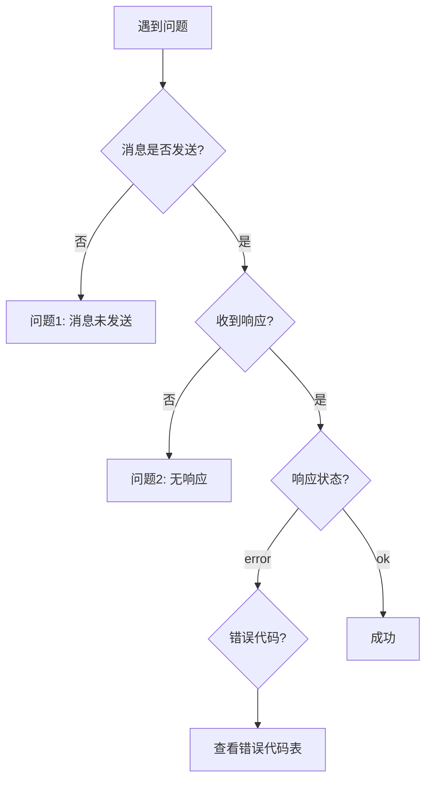

# Mermaid iframe 集成故障排查指南

## 概述

本指南帮助您诊断和解决 draw.io Mermaid iframe 集成中的常见问题。按照问题分类查找相应的解决方案。

## 快速诊断

### 诊断流程图



### 启用调试模式

在排查问题前，建议先启用调试模式以获取详细日志：

**方法 1：URL 参数**
```html
<iframe src="https://app.diagrams.net/?embed=1&proto=json&debugMode=true"></iframe>
```

**方法 2：全局配置**
```javascript
window.DRAWIO_CONFIG = {
    debugMode: true
};
```

**方法 3：浏览器控制台**
```javascript
// 在浏览器控制台中执行
localStorage.setItem('drawio-debug', 'true');
```

启用后，打开浏览器开发者工具（F12）查看控制台日志。

## 常见问题

### 问题 1：消息未被接收

#### 症状
- 发送 postMessage 后没有任何响应
- 控制台没有任何日志输出
- 图表没有生成

#### 可能原因

**原因 1.1：iframe 尚未加载完成**

检查方法：
```javascript
const iframe = document.getElementById('drawio-iframe');
console.log('iframe loaded:', iframe.contentWindow !== null);
```

解决方案：
```javascript
const iframe = document.getElementById('drawio-iframe');

// 方法 1：监听 load 事件
iframe.addEventListener('load', function() {
    console.log('iframe 已加载');
    // 等待额外时间确保插件初始化
    setTimeout(() => {
        sendMessage();
    }, 1000);
});

// 方法 2：检查 readyState
function waitForIframe() {
    if (iframe.contentWindow) {
        setTimeout(() => {
            sendMessage();
        }, 1000);
    } else {
        setTimeout(waitForIframe, 100);
    }
}
waitForIframe();
```

**原因 1.2：消息格式错误**

检查方法：
```javascript
const message = {
    action: 'generateMermaid',
    mermaid: mermaidText
};

// 验证 JSON 格式
try {
    const json = JSON.stringify(message);
    console.log('消息格式正确:', json);
} catch (e) {
    console.error('消息格式错误:', e);
}
```

解决方案：
```javascript
// 确保消息格式正确
const message = {
    action: 'generateMermaid',  // 必需
    mermaid: mermaidText        // 必需，且不能为空
};

// 验证必需字段
if (!message.action || !message.mermaid) {
    console.error('缺少必需字段');
    return;
}

iframe.contentWindow.postMessage(JSON.stringify(message), '*');
```

**原因 1.3：目标 origin 错误**

检查方法：
```javascript
// 检查 iframe 的 origin
console.log('iframe origin:', iframe.contentWindow.location.origin);
```

解决方案：
```javascript
// 使用正确的 target origin
const targetOrigin = 'https://app.diagrams.net';
iframe.contentWindow.postMessage(JSON.stringify(message), targetOrigin);

// 或使用通配符（开发环境）
iframe.contentWindow.postMessage(JSON.stringify(message), '*');
```

**原因 1.4：插件未加载**

检查方法：
```javascript
// 检查 URL 参数
const iframeSrc = iframe.src;
console.log('iframe src:', iframeSrc);
// 应该包含 ?embed=1&proto=json
```

解决方案：
```html
<!-- 确保 URL 参数正确 -->
<iframe src="https://app.diagrams.net/?embed=1&proto=json&spin=1"></iframe>
```

### 问题 2：收到错误响应

#### INVALID_FORMAT（消息格式无效）

**错误信息**：
```json
{
    "event": "generateMermaid",
    "status": "error",
    "error": "Invalid message format",
    "errorCode": "INVALID_FORMAT"
}
```

**原因**：
- 缺少必需字段（action 或 mermaid）
- 字段类型错误

**解决方案**：
```javascript
// 正确的消息格式
const message = {
    action: 'generateMermaid',  // 字符串类型
    mermaid: 'flowchart TD\n    A --> B',  // 字符串类型
    options: {  // 可选，对象类型
        position: { x: 50, y: 50 }
    }
};

// 验证消息
function validateMessage(msg) {
    if (typeof msg.action !== 'string') {
        console.error('action 必须是字符串');
        return false;
    }
    if (typeof msg.mermaid !== 'string') {
        console.error('mermaid 必须是字符串');
        return false;
    }
    if (msg.options && typeof msg.options !== 'object') {
        console.error('options 必须是对象');
        return false;
    }
    return true;
}

if (validateMessage(message)) {
    iframe.contentWindow.postMessage(JSON.stringify(message), '*');
}
```

#### EMPTY_MERMAID（Mermaid 文本为空）

**错误信息**：
```json
{
    "event": "generateMermaid",
    "status": "error",
    "error": "Mermaid text is empty or contains only whitespace",
    "errorCode": "EMPTY_MERMAID"
}
```

**原因**：
- mermaid 字段为空字符串
- mermaid 字段仅包含空白字符

**解决方案**：
```javascript
function validateMermaidText(text) {
    if (!text || !text.trim()) {
        alert('请输入 Mermaid 文本');
        return false;
    }
    return true;
}

const mermaidText = document.getElementById('mermaid-input').value;
if (validateMermaidText(mermaidText)) {
    // 发送消息
}
```

#### PARSE_ERROR（Mermaid 解析失败）

**错误信息**：
```json
{
    "event": "generateMermaid",
    "status": "error",
    "error": "Syntax error at line 2: unexpected token",
    "errorCode": "PARSE_ERROR"
}
```

**原因**：
- Mermaid 语法错误
- 缩进不正确
- 关键字拼写错误

**解决方案**：

1. **检查语法**：
```javascript
// 常见语法错误
// ❌ 错误
flowchart TD
A -> B  // 应该是 -->

// ✓ 正确
flowchart TD
A --> B
```

2. **验证图表类型**：
```javascript
const validTypes = [
    'flowchart',
    'sequenceDiagram',
    'classDiagram',
    'stateDiagram',
    'erDiagram',
    'journey',
    'gantt',
    'pie',
    'gitGraph'
];

function checkDiagramType(mermaidText) {
    const hasValidType = validTypes.some(type => 
        mermaidText.trim().startsWith(type)
    );
    
    if (!hasValidType) {
        console.error('未找到有效的图表类型声明');
        return false;
    }
    return true;
}
```

3. **使用在线验证器**：
   - 访问 [Mermaid Live Editor](https://mermaid.live/) 验证语法
   - 复制粘贴您的 Mermaid 文本
   - 查看错误提示

4. **常见语法错误**：

```javascript
// 错误 1：箭头语法错误
// ❌ 错误
A -> B
// ✓ 正确
A --> B

// 错误 2：缺少图表类型
// ❌ 错误
A --> B
// ✓ 正确
flowchart TD
    A --> B

// 错误 3：标签语法错误
// ❌ 错误
A[开始 --> B
// ✓ 正确
A[开始] --> B

// 错误 4：缩进不一致
// ❌ 错误
flowchart TD
A --> B
  B --> C
// ✓ 正确
flowchart TD
    A --> B
    B --> C
```

#### UNSUPPORTED_TYPE（不支持的图表类型）

**错误信息**：
```json
{
    "event": "generateMermaid",
    "status": "error",
    "error": "Diagram type 'mindmap' is not supported",
    "errorCode": "UNSUPPORTED_TYPE"
}
```

**原因**：
- 使用了 draw.io 不支持的 Mermaid 图表类型

**解决方案**：
```javascript
// 支持的图表类型列表
const supportedTypes = [
    'flowchart',
    'sequenceDiagram',
    'classDiagram',
    'stateDiagram',
    'erDiagram',
    'journey',
    'gantt',
    'pie',
    'gitGraph'
];

// 不支持的类型（示例）
const unsupportedTypes = [
    'mindmap',
    'timeline',
    'quadrantChart'
];

console.log('请使用支持的图表类型：', supportedTypes.join(', '));
```

#### TIMEOUT（解析超时）

**错误信息**：
```json
{
    "event": "generateMermaid",
    "status": "error",
    "error": "Parsing timeout after 10 seconds",
    "errorCode": "TIMEOUT"
}
```

**原因**：
- Mermaid 图表过于复杂
- 解析时间超过 10 秒

**解决方案**：

1. **简化图表**：
```javascript
// ❌ 过于复杂
flowchart TD
    A --> B1
    A --> B2
    A --> B3
    ... // 100+ 个节点

// ✓ 拆分为多个小图表
// 图表 1
flowchart TD
    A --> B1
    A --> B2
    A --> B3

// 图表 2
flowchart TD
    B1 --> C1
    B2 --> C2
```

2. **增加超时时间**（如果可配置）：
```javascript
window.DRAWIO_CONFIG = {
    parseTimeout: 20000  // 增加到 20 秒
};
```

3. **分批处理**：
```javascript
// 将大型图表拆分为多个小图表
function splitLargeDiagram(mermaidText) {
    // 实现拆分逻辑
    // 返回多个小图表
}

const diagrams = splitLargeDiagram(largeMermaidText);
diagrams.forEach((diagram, index) => {
    setTimeout(() => {
        generateDiagram(diagram);
    }, index * 2000);  // 每 2 秒生成一个
});
```

#### INSERT_FAILED（插入失败）

**错误信息**：
```json
{
    "event": "generateMermaid",
    "status": "error",
    "error": "Failed to insert diagram into canvas",
    "errorCode": "INSERT_FAILED"
}
```

**原因**：
- 画布状态异常
- XML 数据格式错误
- 权限问题

**解决方案**：

1. **检查画布状态**：
```javascript
// 确保画布已初始化
// 可以先手动在画布上添加一个元素测试
```

2. **重试机制**：
```javascript
function generateDiagramWithRetry(mermaidText, maxRetries = 3) {
    let retries = 0;
    
    function attempt() {
        iframe.contentWindow.postMessage(JSON.stringify({
            action: 'generateMermaid',
            mermaid: mermaidText
        }), '*');
    }
    
    window.addEventListener('message', function handler(evt) {
        const data = JSON.parse(evt.data);
        
        if (data.event === 'generateMermaid') {
            if (data.status === 'error' && data.errorCode === 'INSERT_FAILED') {
                retries++;
                if (retries < maxRetries) {
                    console.log(`重试 ${retries}/${maxRetries}`);
                    setTimeout(attempt, 1000);
                } else {
                    console.error('达到最大重试次数');
                    window.removeEventListener('message', handler);
                }
            } else {
                window.removeEventListener('message', handler);
            }
        }
    });
    
    attempt();
}
```

#### ORIGIN_DENIED（来源被拒绝）

**错误信息**：
```json
{
    "event": "generateMermaid",
    "status": "error",
    "error": "Message origin not allowed",
    "errorCode": "ORIGIN_DENIED"
}
```

**原因**：
- 消息来源不在允许列表中
- Origin 配置错误

**解决方案**：

1. **配置允许的 origin**：
```javascript
// 方法 1：URL 参数
const allowedOrigin = encodeURIComponent('https://example.com');
const iframeSrc = `https://app.diagrams.net/?embed=1&proto=json&allowedOrigins=${allowedOrigin}`;

// 方法 2：全局配置
window.DRAWIO_CONFIG = {
    allowedOrigins: ['https://example.com', 'http://localhost:3000']
};
```

2. **开发环境使用通配符**：
```javascript
// 仅在开发环境使用
const iframeSrc = 'https://app.diagrams.net/?embed=1&proto=json&allowedOrigins=*';
```

3. **检查当前 origin**：
```javascript
console.log('当前页面 origin:', window.location.origin);
// 确保此 origin 在允许列表中
```

#### SIZE_EXCEEDED（消息过大）

**错误信息**：
```json
{
    "event": "generateMermaid",
    "status": "error",
    "error": "Message size exceeds 1MB limit",
    "errorCode": "SIZE_EXCEEDED"
}
```

**原因**：
- Mermaid 文本过大（超过 1MB）

**解决方案**：

1. **检查消息大小**：
```javascript
function checkMessageSize(message) {
    const size = new Blob([JSON.stringify(message)]).size;
    const maxSize = 1024 * 1024; // 1MB
    
    console.log(`消息大小: ${(size / 1024).toFixed(2)} KB`);
    
    if (size > maxSize) {
        console.error('消息过大，请简化图表');
        return false;
    }
    return true;
}
```

2. **压缩 Mermaid 文本**：
```javascript
function compressMermaid(mermaidText) {
    // 移除多余的空白
    return mermaidText
        .split('\n')
        .map(line => line.trim())
        .filter(line => line.length > 0)
        .join('\n');
}

const compressed = compressMermaid(mermaidText);
```

3. **拆分大型图表**：
```javascript
// 将大型图表拆分为多个小图表
// 每个图表单独发送
```

#### XSS_DETECTED（检测到 XSS 攻击）

**错误信息**：
```json
{
    "event": "generateMermaid",
    "status": "error",
    "error": "Potential XSS attack detected",
    "errorCode": "XSS_DETECTED"
}
```

**原因**：
- Mermaid 文本包含危险脚本
- 包含 `<script>` 标签、`javascript:` 协议等

**解决方案**：

1. **清理输入**：
```javascript
function sanitizeMermaid(mermaidText) {
    // 移除危险内容
    return mermaidText
        .replace(/<script[\s\S]*?>[\s\S]*?<\/script>/gi, '')
        .replace(/javascript:/gi, '')
        .replace(/on\w+\s*=/gi, '')
        .replace(/<iframe/gi, '');
}

const sanitized = sanitizeMermaid(mermaidText);
```

2. **验证输入**：
```javascript
function containsDangerousContent(text) {
    const dangerousPatterns = [
        /<script/i,
        /javascript:/i,
        /on\w+\s*=/i,
        /<iframe/i
    ];
    
    return dangerousPatterns.some(pattern => pattern.test(text));
}

if (containsDangerousContent(mermaidText)) {
    alert('输入包含不安全的内容');
    return;
}
```

#### UNSUPPORTED_BROWSER（浏览器不支持）

**错误信息**：
```json
{
    "event": "generateMermaid",
    "status": "error",
    "error": "Browser does not support required features",
    "errorCode": "UNSUPPORTED_BROWSER"
}
```

**原因**：
- 浏览器版本过旧
- 缺少必需的 API（如 structuredClone）

**解决方案**：

1. **检测浏览器兼容性**：
```javascript
function checkBrowserCompatibility() {
    const required = {
        postMessage: typeof window.postMessage === 'function',
        structuredClone: typeof structuredClone === 'function',
        Promise: typeof Promise !== 'undefined'
    };
    
    const missing = Object.keys(required).filter(key => !required[key]);
    
    if (missing.length > 0) {
        console.error('浏览器缺少以下功能:', missing);
        return false;
    }
    return true;
}

if (!checkBrowserCompatibility()) {
    alert('您的浏览器版本过旧，请升级到最新版本');
}
```

2. **显示升级提示**：
```javascript
const minVersions = {
    chrome: 90,
    firefox: 88,
    safari: 14,
    edge: 90
};

console.log('最低浏览器版本要求:', minVersions);
```

### 问题 3：性能问题

#### 症状
- 图表生成缓慢
- 浏览器卡顿
- 内存占用过高

#### 解决方案

**1. 优化图表复杂度**：
```javascript
// 限制节点数量
function validateComplexity(mermaidText) {
    const nodeCount = (mermaidText.match(/-->/g) || []).length;
    const maxNodes = 50;
    
    if (nodeCount > maxNodes) {
        console.warn(`图表过于复杂（${nodeCount} 个连接），建议拆分`);
        return false;
    }
    return true;
}
```

**2. 使用节流**：
```javascript
function throttle(func, delay) {
    let timeout = null;
    return function(...args) {
        if (!timeout) {
            timeout = setTimeout(() => {
                func.apply(this, args);
                timeout = null;
            }, delay);
        }
    };
}

const throttledGenerate = throttle(generateDiagram, 1000);
```

**3. 延迟加载**：
```javascript
// 仅在需要时加载 iframe
let iframeLoaded = false;

function loadIframeOnDemand() {
    if (!iframeLoaded) {
        const iframe = document.createElement('iframe');
        iframe.id = 'drawio-iframe';
        iframe.src = 'https://app.diagrams.net/?embed=1&proto=json';
        document.getElementById('container').appendChild(iframe);
        iframeLoaded = true;
    }
}
```

## 调试技巧

### 1. 查看完整的消息流

```javascript
// 记录所有 postMessage
const originalPostMessage = window.postMessage;
window.postMessage = function(...args) {
    console.log('postMessage 发送:', args);
    return originalPostMessage.apply(this, args);
};

// 记录所有接收的消息
window.addEventListener('message', function(evt) {
    console.log('收到消息:', {
        origin: evt.origin,
        data: evt.data,
        source: evt.source
    });
}, true);
```

### 2. 使用浏览器开发者工具

**Chrome DevTools**：
1. 打开开发者工具（F12）
2. 切换到 Console 标签
3. 过滤日志：输入 `mermaid` 或 `generateMermaid`
4. 查看 Network 标签检查 iframe 加载

**Firefox Developer Tools**：
1. 打开开发者工具（F12）
2. 使用 Console 和 Network 标签
3. 启用"持久日志"选项

### 3. 测试消息格式

```javascript
// 创建测试函数
function testMessage() {
    const testCases = [
        {
            name: '基本消息',
            message: {
                action: 'generateMermaid',
                mermaid: 'flowchart TD\n    A --> B'
            }
        },
        {
            name: '带选项的消息',
            message: {
                action: 'generateMermaid',
                mermaid: 'flowchart TD\n    A --> B',
                options: {
                    position: { x: 100, y: 100 },
                    scale: 1.5
                }
            }
        }
    ];
    
    testCases.forEach(test => {
        console.log(`测试: ${test.name}`);
        try {
            const json = JSON.stringify(test.message);
            console.log('✓ JSON 格式正确');
            console.log('消息:', json);
        } catch (e) {
            console.error('✗ JSON 格式错误:', e);
        }
    });
}

testMessage();
```

### 4. 监控性能

```javascript
function measurePerformance() {
    const start = performance.now();
    
    window.addEventListener('message', function handler(evt) {
        const data = JSON.parse(evt.data);
        
        if (data.event === 'generateMermaid') {
            const duration = performance.now() - start;
            console.log(`生成耗时: ${duration.toFixed(2)}ms`);
            window.removeEventListener('message', handler);
        }
    });
    
    // 发送消息
    generateDiagram(mermaidText);
}
```

## 检查清单

在报告问题前，请检查以下项目：

- [ ] iframe 已完全加载
- [ ] URL 参数包含 `embed=1&proto=json`
- [ ] 消息格式正确（包含 action 和 mermaid 字段）
- [ ] Mermaid 文本不为空
- [ ] Mermaid 语法正确（可在 mermaid.live 验证）
- [ ] 浏览器版本符合要求
- [ ] 已启用调试模式
- [ ] 已查看浏览器控制台日志
- [ ] Origin 配置正确（如果有限制）
- [ ] 消息大小未超过 1MB
- [ ] 没有跨域问题

## 获取帮助

如果以上方法都无法解决问题，请：

1. **收集信息**：
   - 浏览器类型和版本
   - 错误消息和错误代码
   - 完整的控制台日志
   - Mermaid 文本示例
   - 重现步骤

2. **创建最小可复现示例**：
```html
<!DOCTYPE html>
<html>
<head>
    <title>问题复现</title>
</head>
<body>
    <iframe 
        id="drawio-iframe"
        src="https://app.diagrams.net/?embed=1&proto=json&debugMode=true"
        width="800" 
        height="600">
    </iframe>
    
    <script>
        // 最小化的复现代码
        const iframe = document.getElementById('drawio-iframe');
        
        iframe.addEventListener('load', function() {
            setTimeout(() => {
                iframe.contentWindow.postMessage(JSON.stringify({
                    action: 'generateMermaid',
                    mermaid: 'flowchart TD\n    A --> B'
                }), '*');
            }, 1000);
        });
        
        window.addEventListener('message', function(evt) {
            console.log('收到响应:', evt.data);
        });
    </script>
</body>
</html>
```

3. **联系支持**：
   - 提供收集的信息
   - 附上最小可复现示例
   - 说明预期行为和实际行为

## 相关资源

- [API 文档](./MERMAID_IFRAME_API.md)
- [集成指南](./MERMAID_IFRAME_INTEGRATION_GUIDE.md)
- [Mermaid 官方文档](https://mermaid.js.org/)
- [draw.io 官方文档](https://www.diagrams.net/doc/)

## 常见问题 FAQ

**Q: 为什么我的消息没有收到响应？**
A: 最常见的原因是 iframe 尚未完全加载。请使用 `iframe.addEventListener('load', ...)` 等待加载完成。

**Q: 如何知道我的 Mermaid 语法是否正确？**
A: 访问 [Mermaid Live Editor](https://mermaid.live/) 验证您的语法。

**Q: 支持哪些 Mermaid 图表类型？**
A: 支持 flowchart、sequenceDiagram、classDiagram、stateDiagram、erDiagram、journey、gantt、pie 和 gitGraph。

**Q: 如何在生产环境中配置安全的 origin？**
A: 使用 `allowedOrigins` 参数指定允许的域名，避免使用通配符 `*`。

**Q: 消息大小限制是多少？**
A: 默认限制为 1MB。如果超过，请简化图表或拆分为多个小图表。

**Q: 如何启用详细的调试日志？**
A: 在 iframe URL 中添加 `debugMode=true` 参数，或设置全局配置 `window.DRAWIO_CONFIG.debugMode = true`。
